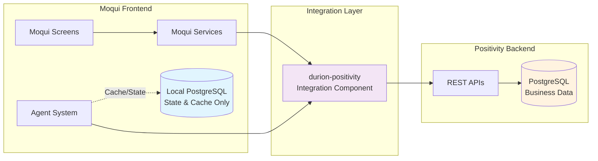

# Durion-Moqui-Frontend Agent Structure Design

## Overview

The Durion-Moqui-Frontend Agent Structure System is a comprehensive framework that provides specialized AI agents for Moqui Framework development, Vue.js 3 frontend implementation, testing, deployment, and operations. The system is designed to support the Durion Enterprise Tire Service Management System (DETSMS) with five primary business domains—Work Execution, Inventory Control, Product & Pricing, CRM, and Accounting—providing domain-specific guidance while maintaining consistency across all components.

The agent structure provides specialized AI assistants that support the unique characteristics of Moqui Framework development (entities, services, screens, transitions) and Vue.js 3 Composition API patterns while ensuring proper integration with durion-positivity-backend service APIs through the durion-positivity integration component.

The design follows a modular, extensible architecture that allows for easy addition of new agents while ensuring seamless collaboration between existing agents. The system emphasizes practical guidance delivery, performance optimization, and production-ready patterns for enterprise Moqui applications with modern frontend integration.

## Architecture

### High-Level Architecture

```mermaid
graph TB
    subgraph "Agent Framework Core"
        AR[Agent Registry]
        AM[Agent Manager]
        CC[Collaboration Controller]
        CM[Context Manager]
    end
    
    subgraph "Foundation Agents"
        MFA[Moqui Framework Agent]
        AA[Architecture Agent]
        VUE[Vue.js Agent]
    end
    
    subgraph "Implementation Agents"
        DA[Domain Agent]
        ELA[Experience Layer Agent]
        FE[Frontend Agent]
    end
    
    subgraph "Infrastructure Agents"
        SA[Security Agent]
        DEVOPS[DevOps Agent]
        DB[Database Agent]
    end
    
    subgraph "Quality Assurance Agents"
        TA[Testing Agent]
        PERF[Performance Agent]
        PAIR[Pair Navigator Agent]
    end
    
    subgraph "Support Agents"
        DOC[Documentation Agent]
        INT[Integration Agent]
        API[API Contract Agent]
    end
    
    subgraph "External Integrations"
        POS[Positivity Backend]
        DOCKER[Docker]
        PSQL[PostgreSQL/MySQL]
        MON[Monitoring Tools]
    end
    
    AR --> AM
    AM --> CC
    CC --> CM
    
    AM --> MFA
    AM --> AA
    AM --> VUE
    AM --> DA
    AM --> ELA
    AM --> FE
    AM --> SA
    AM --> DEVOPS
    AM --> DB
    AM --> TA
    AM --> PERF
    AM --> PAIR
    AM --> DOC
    AM --> INT
    AM --> API
    
    MFA --> POS
    ELA --> POS
    DEVOPS --> DOCKER
    DB --> PSQL
    PERF --> MON
```



### Layered Architecture

The system follows a layered architecture organized into six specialized tiers:

1. **Agent Framework Core**: Registry, manager, collaboration controller, context manager
2. **Foundation Layer**: Moqui Framework, Architecture, and Vue.js expertise
3. **Implementation Layer**: Domain, Experience Layer, and Frontend implementation
4. **Infrastructure Layer**: Security, DevOps, and Database management
5. **Quality Assurance Layer**: Testing, Performance, and Pair Programming
6. **Support Layer**: Documentation, Integration, and API Contract management

### Agent Collaboration Model

Agents operate in three collaboration modes:

1. **Independent Mode**: Single agent provides specialized guidance
2. **Collaborative Mode**: Multiple agents work together on complex tasks
3. **Pair Programming Mode**: Primary agent paired with navigator for quality assurance

## Components and Interfaces

### Core Framework Components

#### Agent Registry
- **Purpose**: Central registry for all available agents
- **Responsibilities**:
  - Agent discovery and registration
  - Capability mapping and routing
  - Agent lifecycle management
  - Health monitoring and failover

#### Agent Manager
- **Purpose**: Orchestrates agent interactions and resource allocation
- **Responsibilities**:
  - Request routing and load balancing
  - Agent instantiation and pooling
  - Performance monitoring and optimization
  - Error handling and recovery

#### Collaboration Controller
- **Purpose**: Manages multi-agent collaboration and conflict resolution
- **Responsibilities**:
  - Collaboration workflow orchestration
  - Conflict detection and resolution
  - Consensus building and decision making
  - Quality assurance coordination

#### Context Manager
- **Purpose**: Maintains context across agent interactions
- **Responsibilities**:
  - Session context storage and retrieval
  - Context sharing between agents
  - Context validation and integrity
  - Temporary context cleanup

### Agent Interface Specifications

#### Base Agent Interface

```groovy
interface Agent {
    String getAgentId()
    String getAgentName()
    Set<String> getCapabilities()
    AgentResponse processRequest(AgentRequest request)
    boolean canHandle(AgentRequest request)
    AgentHealth getHealth()
}
```

#### Specialized Agent Interfaces

```groovy
interface MoquiFrameworkAgent extends Agent {
    EntityGuidance provideEntityGuidance(EntityContext context)
    ServiceGuidance provideServiceGuidance(ServiceContext context)
    ScreenGuidance provideScreenGuidance(ScreenContext context)
    IntegrationGuidance providePositivityIntegration(IntegrationContext context)
}

interface VueAgent extends Agent {
    ComponentGuidance provideComponentGuidance(ComponentContext context)
    CompositionAPIGuidance provideCompositionGuidance(CompositionContext context)
    StateManagementGuidance provideStateGuidance(StateContext context)
    TypeScriptGuidance provideTypeScriptGuidance(TypeScriptContext context)
}

interface DomainAgent extends Agent {
    WorkExecutionGuidance provideWorkExecGuidance(WorkExecContext context)
    InventoryGuidance provideInventoryGuidance(InventoryContext context)
    ProductGuidance provideProductGuidance(ProductContext context)
    CRMGuidance provideCRMGuidance(CRMContext context)
    AccountingGuidance provideAccountingGuidance(AccountingContext context)
}

interface PairNavigatorAgent extends Agent {
    LoopDetectionResult detectImplementationLoops(ImplementationContext context)
    ArchitecturalDriftResult detectArchitecturalDrift(ArchitecturalContext context)
    SimplificationGuidance provideScopeCreepGuidance(ScopeContext context)
}
```

### Agent Hierarchy

```yaml
MoquiAgentHierarchy:
  foundation_layer:
    - moqui_framework_agent
    - architecture_agent
    - vue_agent
    
  implementation_layer:
    - domain_agent
    - experience_layer_agent
    - frontend_agent
    
  infrastructure_layer:
    - security_agent
    - devops_agent
    - database_agent
    
  quality_assurance_layer:
    - testing_agent
    - performance_agent
    - pair_navigator_agent
    
  support_layer:
    - documentation_agent
    - integration_agent
    - api_contract_agent
```

### Agent Specifications

#### 1. Moqui Framework Agent

**Purpose**: Provides core Moqui Framework development expertise and best practices

**Capabilities**:

- Guides implementation of Moqui entities, services, screens, and transitions
- Ensures proper use of Moqui screen widgets, forms, and UI patterns
- Enforces Moqui naming conventions and component structure
- Provides guidance on Moqui-specific features (workflows, artifacts, etc.)
- Ensures proper component dependencies and framework integration
- Guides developers to use durion-positivity-backend APIs for business data persistence

**Integration Points**:

- Coordinates with Architecture Agent for component design decisions
- Works with Domain Agent for business logic implementation
- Collaborates with Security Agent for Moqui security patterns

#### 2. Architecture Agent

**Purpose**: Maintains architectural consistency and domain boundaries across DETSMS components

**Capabilities**:

- Defines and enforces domain boundaries for the five DETSMS business domains
- Ensures proper component placement and dependency management
- Guides integration patterns through durion-positivity component to durion-positivity-backend
- Manages architectural decisions and component relationships
- Enforces separation between business logic (durion-positivity-backend) and presentation (Moqui)
- Creates specifications for missing durion-positivity-backend APIs when required

**Integration Points**:

- Provides architectural guidance to all other agents
- Coordinates with workspace-level Workspace Architecture Agent
- Works with Experience Layer Agent for cross-domain coordination

#### 3. Domain Agent

**Purpose**: Provides specialized expertise for the five DETSMS business domains

**Capabilities**:

- **Work Execution Domain**: Estimate-to-payment workflows and business process management
- **Inventory Control**: Inventory tracking, reservation, and consumption patterns
- **Product & Pricing**: Catalog management and dynamic pricing calculations
- **CRM Domain**: Customer and vehicle management with service history tracking
- **Accounting Integration**: Basic accounts receivable and payment processing
- Ensures proper domain-specific business logic implementation
- Guides integration with durion-positivity-backend service APIs for each domain

**Integration Points**:

- Works with Architecture Agent for domain boundary enforcement
- Coordinates with Experience Layer Agent for cross-domain workflows
- Collaborates with Security Agent for domain-specific security requirements

#### 4. Experience Layer Agent

**Purpose**: Specializes in orchestration services and cross-domain coordination

**Capabilities**:

- Designs task-oriented APIs for UI/Mobile/MCP integration
- Coordinates cross-domain workflow implementation
- Ensures proper mobile-optimized data transfer and offline synchronization
- Provides guidance for conversational AI interfaces and MCP integration
- Manages error recovery and state management for complex workflows
- Enforces durion-positivity experience API patterns

**Integration Points**:

- Coordinates with Domain Agent for cross-domain workflows
- Works with Architecture Agent for integration pattern enforcement
- Collaborates with workspace-level API Contract Agent

#### 5. Security Agent

**Purpose**: Ensures comprehensive security across all DETSMS domains and integration points

**Capabilities**:

- Implements Moqui security patterns and JWT integration
- Ensures proper entity-level security constraints and field-level access control
- Provides guidance for service-level authorization and input validation
- Implements proper screen-level security and user interface protection
- Guides secure API integration and data protection with external systems
- Coordinates with positivity backend security patterns

**Integration Points**:

- Works with all agents for security requirement enforcement
- Coordinates with workspace-level Unified Security Agent
- Collaborates with DevOps Agent for secure deployment practices

#### 6. DevOps Agent

**Purpose**: Manages Moqui application deployment, configuration, and monitoring

**Capabilities**:

- Implements Moqui deployment patterns and configuration management
- Ensures proper environment-specific configuration and data management
- Provides guidance for Moqui-specific monitoring and performance tracking
- Implements proper Moqui clustering and load balancing configuration
- Guides Moqui-specific debugging and problem resolution
- Coordinates deployment with positivity backend systems

**Integration Points**:

- Coordinates with workspace-level Full-Stack DevOps Agent
- Works with Performance Agent for monitoring and optimization
- Collaborates with Security Agent for secure deployment

#### 7. Testing Agent

**Purpose**: Implements comprehensive testing strategies for Moqui components and workflows

**Capabilities**:

- Specializes in Moqui entity testing and data validation
- Ensures proper service testing with Moqui test framework and mock data
- Provides guidance for UI testing and user interaction validation
- Implements proper testing of cross-domain business processes
- Guides testing of MCP, mobile, and external system integrations
- Coordinates testing with positivity backend integration points

**Integration Points**:

- Works with all agents for comprehensive test coverage
- Coordinates with workspace-level End-to-End Testing Agent
- Collaborates with Performance Agent for performance testing

#### 8. Performance Agent

**Purpose**: Optimizes DETSMS performance across all domains and integration points

**Capabilities**:

- Specializes in Moqui entity performance and database optimization
- Ensures efficient service implementation and caching strategies
- Provides guidance for UI performance and responsive design
- Optimizes cross-domain communication and data flow efficiency
- Implements Moqui-specific performance metrics and alerting
- Coordinates performance optimization with positivity backend

**Integration Points**:

- Works with all agents for performance considerations
- Coordinates with workspace-level Workspace SRE Agent
- Collaborates with DevOps Agent for monitoring implementation

#### 9. Documentation Agent

**Purpose**: Maintains comprehensive documentation for all DETSMS components and APIs

**Capabilities**:

- Specializes in Moqui entity documentation and data model diagrams
- Ensures comprehensive service documentation with parameter descriptions and examples
- Provides guidance for UI documentation and user workflow guides
- Implements proper REST API documentation with OpenAPI specifications
- Ensures documentation stays synchronized with Moqui component evolution
- Documents integration patterns with positivity backend APIs

**Integration Points**:

- Works with all agents for documentation requirements
- Coordinates with workspace-level agents for cross-project documentation
- Collaborates with Experience Layer Agent for API documentation

## Code Generation Structure

All agent implementations, test classes, and generated artifacts are organized within the `.kiro/generated/` directory to maintain clear separation from application code and support automated code generation workflows.

### Directory Structure

```
moqui_example/
├── .kiro/
│   ├── generated/
│   │   ├── agents/
│   │   │   ├── foundation/
│   │   │   │   ├── MoquiFrameworkAgentImpl.groovy
│   │   │   │   ├── ArchitectureAgentImpl.groovy
│   │   │   │   └── VueAgentImpl.groovy
│   │   │   ├── implementation/
│   │   │   │   ├── DomainAgentImpl.groovy
│   │   │   │   ├── ExperienceLayerAgentImpl.groovy
│   │   │   │   └── FrontendAgentImpl.groovy
│   │   │   ├── infrastructure/
│   │   │   │   ├── SecurityAgentImpl.groovy
│   │   │   │   ├── DevOpsAgentImpl.groovy
│   │   │   │   └── DatabaseAgentImpl.groovy
│   │   │   ├── quality/
│   │   │   │   ├── TestingAgentImpl.groovy
│   │   │   │   ├── PerformanceAgentImpl.groovy
│   │   │   │   └── PairNavigatorAgentImpl.groovy
│   │   │   └── support/
│   │   │       ├── DocumentationAgentImpl.groovy
│   │   │       ├── IntegrationAgentImpl.groovy
│   │   │       └── APIContractAgentImpl.groovy
│   │   ├── tests/
│   │   │   ├── specs/
│   │   │   │   ├── MoquiFrameworkAgentSpec.groovy      # Spock specifications
│   │   │   │   ├── DomainAgentSpec.groovy
│   │   │   │   ├── SecurityAgentSpec.groovy
│   │   │   │   └── ...
│   │   │   ├── properties/
│   │   │   │   ├── AgentPerformanceProperties.groovy    # jqwik property tests
│   │   │   │   ├── AgentCorrectnessProperties.groovy
│   │   │   │   └── IntegrationProperties.groovy
│   │   │   └── integration/
│   │   │       ├── PositivityIntegrationSpec.groovy
│   │   │       ├── CrossAgentCollaborationSpec.groovy
│   │   │       └── ...
│   │   ├── models/
│   │   │   ├── AgentRequest.groovy
│   │   │   ├── AgentResponse.groovy
│   │   │   ├── contexts/
│   │   │   │   ├── MoquiContext.groovy
│   │   │   │   ├── VueContext.groovy
│   │   │   │   └── DomainContext.groovy
│   │   │   └── guidance/
│   │   │       ├── EntityGuidance.groovy
│   │   │       ├── ServiceGuidance.groovy
│   │   │       └── ...
│   │   ├── config/
│   │   │   ├── agent-registry.yaml
│   │   │   ├── collaboration-rules.yaml
│   │   │   └── performance-thresholds.yaml
│   │   └── docs/
│   │       ├── agent-api/
│   │       └── integration-guides/
│   └── specs/
│       └── agent-structure/
│           ├── design.md
│           └── requirements.md
```

### Code Generation Patterns

#### Agent Implementation Classes

Agent implementations in `.kiro/generated/agents/` follow these patterns:

```groovy
// Example: .kiro/generated/agents/foundation/MoquiFrameworkAgentImpl.groovy
package durion.moqui.agents.foundation

import durion.moqui.agents.Agent
import durion.moqui.agents.MoquiFrameworkAgent
import durion.moqui.models.*

class MoquiFrameworkAgentImpl implements MoquiFrameworkAgent {
    
    private final AgentRegistry registry
    private final ContextManager contextManager
    private final KnowledgeBase knowledgeBase
    
    @Override
    String getAgentId() { return "moqui-framework-agent" }
    
    @Override
    String getAgentName() { return "Moqui Framework Agent" }
    
    @Override
    Set<String> getCapabilities() {
        return ["entity-guidance", "service-guidance", "screen-guidance", 
                "positivity-integration"] as Set
    }
    
    @Override
    EntityGuidance provideEntityGuidance(EntityContext context) {
        // Generated implementation logic
        // Response time target: 2 seconds (REQ-001 AC1)
        // Accuracy target: 95% (REQ-001 AC1)
    }
    
    // Additional method implementations...
}
```

#### Test Class Generation

Test specifications in `.kiro/generated/tests/specs/` use Spock Framework:

```groovy
// Example: .kiro/generated/tests/specs/MoquiFrameworkAgentSpec.groovy
package durion.moqui.agents.specs

import spock.lang.Specification
import spock.lang.Timeout
import java.util.concurrent.TimeUnit

class MoquiFrameworkAgentSpec extends Specification {
    
    MoquiFrameworkAgentImpl agent
    
    def setup() {
        agent = new MoquiFrameworkAgentImpl(
            registry: Mock(AgentRegistry),
            contextManager: Mock(ContextManager),
            knowledgeBase: Mock(KnowledgeBase)
        )
    }
    
    @Timeout(value = 2, unit = TimeUnit.SECONDS)
    def "should provide entity guidance within 2 seconds"() {
        given: "an entity context for a DETSMS entity"
        def context = new EntityContext(
            entityName: "WorkOrder",
            domain: "WorkExecution"
        )
        
        when: "entity guidance is requested"
        def guidance = agent.provideEntityGuidance(context)
        
        then: "guidance is provided with 95% accuracy"
        guidance != null
        guidance.recommendations.size() > 0
        guidance.accuracy >= 0.95
        guidance.responseTime <= 2000 // milliseconds
    }
    
    // Additional test cases mapping to REQ-001 acceptance criteria...
}
```

#### Property-Based Test Generation

Correctness properties in `.kiro/generated/tests/properties/` use jqwik:

```groovy
// Example: .kiro/generated/tests/properties/AgentPerformanceProperties.groovy
package durion.moqui.agents.properties

import net.jqwik.api.*
import durion.moqui.agents.foundation.MoquiFrameworkAgentImpl

class AgentPerformanceProperties {
    
    @Property
    @Label("REQ-009 AC1: Agent responses complete within 3 seconds")
    boolean allAgentResponsesComplete Within3Seconds(
        @ForAll("agentTypes") String agentType,
        @ForAll("requestContexts") AgentRequest request
    ) {
        def agent = createAgent(agentType)
        def startTime = System.currentTimeMillis()
        def response = agent.processRequest(request)
        def duration = System.currentTimeMillis() - startTime
        
        return duration < 3000 // 3 seconds in milliseconds
    }
    
    @Property
    @Label("REQ-009 AC2: System supports 50 concurrent developers")
    boolean systemSupports50ConcurrentUsers(
        @ForAll @IntRange(min = 1, max = 50) int concurrentUsers
    ) {
        def requests = generateConcurrentRequests(concurrentUsers)
        def responses = executeParallel(requests)
        def performanceDegradation = calculateDegradation(responses)
        
        return performanceDegradation < 0.10 // Less than 10% degradation
    }
    
    // Additional property tests for REQ-009 through REQ-014...
}
```

### Generation Workflow

1. **Agent Interface Definition**: Groovy interfaces defined in design specification
2. **Implementation Generation**: KIRO generates agent implementation stubs in `.kiro/generated/agents/`
3. **Test Generation**: KIRO generates Spock specifications and jqwik properties in `.kiro/generated/tests/`
4. **Model Generation**: Data model classes generated in `.kiro/generated/models/`
5. **Configuration Generation**: YAML configuration files generated in `.kiro/generated/config/`

### Build Integration

Generated code integrates with Gradle build:

```gradle
// build.gradle
sourceSets {
    main {
        groovy {
            srcDirs += ['.kiro/generated/agents', '.kiro/generated/models']
        }
    }
    test {
        groovy {
            srcDirs += ['.kiro/generated/tests']
        }
    }
}

// Clean task to regenerate code
task cleanGenerated(type: Delete) {
    delete '.kiro/generated/agents', '.kiro/generated/tests', '.kiro/generated/models'
}

clean.dependsOn cleanGenerated
```

## Data Models

### Core Data Models

#### Agent Request Model

```groovy
class AgentRequest {
    String requestId
    String requestType
    String sourceAgent
    Map<String, Object> parameters
    RequestContext context
    Priority priority
    Timestamp timestamp
}
```

#### Agent Response Model

```groovy
class AgentResponse {
    String responseId
    String requestId
    String respondingAgent
    ResponseStatus status
    Object payload
    List<String> recommendations
    Map<String, Object> metadata
    Timestamp timestamp
}
```

#### Context Models

```groovy
class MoquiContext {
    String componentId
    String componentName
    List<String> dependencies
    Map<String, Object> configuration
    List<String> constraints
}

class ImplementationContext {
    String domainId
    String businessProcess
    TechnologyStack stack
    List<Dependency> dependencies
    Map<String, Object> integrationPoints
}

class ArchitecturalContext {
    String systemId
    List<ComponentDefinition> components
    List<IntegrationPoint> integrations
    ArchitecturalPrinciples principles
    List<QualityAttribute> qualityAttributes
}
```

### Domain-Specific Models

#### Moqui Component Model

```groovy
class MoquiComponent {
    String componentName
    String version
    List<EntityDefinition> entities
    List<ServiceDefinition> services
    List<ScreenDefinition> screens
    SecurityConfiguration security
    List<Dependency> dependencies
}
```

#### Vue.js Application Model

```groovy
class VueApplication {
    String appName
    String version
    List<ComponentDefinition> components
    StateManagementConfig state
    RouterConfig routing
    TypeScriptConfig typescript
    List<Dependency> dependencies
}
```

#### Integration Model

```groovy
class PositivityIntegration {
    String sourceComponent
    String targetAPI
    IntegrationType type // REST, Event, Batch
    SecurityRequirements security
    PerformanceRequirements performance
    ErrorHandling errorStrategy
}
```

### Agent Capability Registry

```yaml
AgentCapabilityRegistry:
  moqui_framework_agent:
    expertise: [entities, services, screens, transitions, widgets, forms]
    integration_focus: durion_positivity_backend_api_guidance
    
  architecture_agent:
    expertise: [domain_boundaries, component_design, integration_patterns]
    domains: [work_execution, inventory, product_pricing, crm, accounting]
    
  domain_agent:
    specializations:
      work_execution: [estimates, workorders, invoicing, payments, warranty]
      inventory: [tracking, reservation, consumption, alternatives, backorders]
      product_pricing: [catalog, pricing, discounts, customer_specific]
      crm: [customers, vehicles, service_history, fleet_management]
      accounting: [invoicing, payments, accounts_receivable, audit_trail]
      
  experience_layer_agent:
    expertise: [orchestration, mobile_apis, mcp_integration, cross_domain_workflows]
    integration_patterns: [durion_positivity, error_recovery, state_management]
    
  security_agent:
    expertise: [moqui_security, jwt_integration, entity_security, service_authorization]
    integration_focus: durion_positivity_backend_security_coordination
    
  devops_agent:
    expertise: [moqui_deployment, configuration, monitoring, clustering, debugging]
    coordination: workspace_devops_agent
    
  testing_agent:
    expertise: [entity_testing, service_testing, ui_testing, workflow_testing, integration_testing]
    frameworks: [moqui_test_framework, mock_data, cross_domain_testing]
    
  performance_agent:
    expertise: [entity_optimization, service_optimization, ui_performance, workflow_efficiency]
    monitoring: [moqui_metrics, alerting, performance_tracking]
    
  documentation_agent:
    expertise: [entity_docs, service_docs, ui_docs, api_docs, integration_docs]
    formats: [openapi, data_models, workflow_guides, user_documentation]
```

### Domain Integration Matrix

```yaml
DomainIntegrationMatrix:
  work_execution:
    positivity_apis: [customer_lookup, vehicle_management, pricing_calculation, payment_processing]
    moqui_components: [estimate_screens, workorder_management, invoice_generation]
    
  inventory:
    positivity_apis: [inventory_lookup, reservation_management, consumption_tracking]
    moqui_components: [inventory_screens, parts_selection, availability_checking]
    
  product_pricing:
    positivity_apis: [catalog_management, pricing_engine, discount_calculation]
    moqui_components: [product_screens, pricing_displays, catalog_browsing]
    
  crm:
    positivity_apis: [customer_data, vehicle_data, service_history]
    moqui_components: [customer_screens, vehicle_forms, history_displays]
    
  accounting:
    positivity_apis: [invoice_posting, payment_recording, account_management]
    moqui_components: [accounting_screens, payment_forms, balance_displays]
```

### Component Dependency Structure

```yaml
ComponentDependencyStructure:
  durion_components:
    durion_common:
      purpose: shared_utilities_and_base_functionality
      dependencies: [mantle_udm, mantle_usl]
      
    durion_theme:
      purpose: ui_theming_and_styling
      dependencies: [durion_common, SimpleScreens]
      
    durion_positivity:
      purpose: integration_component_for_durion_positivity_backend_services
      dependencies: [durion_common]
      
    durion_crm:
      purpose: customer_relationship_management
      dependencies: [durion_common, durion_positivity, durion_theme]
      
    durion_inventory:
      purpose: inventory_management
      dependencies: [durion_common, durion_positivity, durion_theme]
      
    durion_product:
      purpose: product_catalog_management
      dependencies: [durion_common, durion_positivity, durion_theme]
      
    durion_workexec:
      purpose: work_execution_and_scheduling
      dependencies: [durion_common, durion_positivity, durion_theme, durion_crm, durion_inventory, durion_product]
      
    durion_accounting:
      purpose: financial_and_accounting_features
      dependencies: [durion_common, durion_positivity, durion_theme, durion_workexec]
      
    durion_experience:
      purpose: user_experience_enhancements
      dependencies: [durion_common, durion_positivity, durion_theme]
      
    durion_demo_data:
      purpose: demo_data_for_development
      dependencies: [all_durion_components]
```

## Correctness Properties

*A property is a characteristic or behavior that should hold true across all valid executions of a system-essentially, a formal statement about what the system should do. Properties serve as the bridge between human-readable specifications and machine-verifiable correctness guarantees.*

Based on the prework analysis, the following correctness properties have been identified to validate the durion-moqui-frontend agent structure implementation:

### Property Reflection

After reviewing all properties identified in the prework, several areas of redundancy were identified:

- Properties about "having specialized agents" (examples) can be consolidated into agent registry validation
- Properties about "agent behavior for all X scenarios" can be combined where they cover similar guidance patterns
- Properties about "consistent guidance provision" can be unified under comprehensive guidance validation

### Core Properties

**Property 1: Moqui Framework guidance consistency**
*For any* Moqui development task, agents should provide consistent guidance on framework patterns, durion-positivity-backend API usage via durion-positivity component, and component integration while respecting domain boundaries
**Validates: Requirements 1.1, 1.2, 1.3, 1.4, 1.5**

**Property 2: Domain-specific expertise provision**
*For any* business domain implementation (Work Execution, Inventory, Product & Pricing, CRM, Accounting), agents should provide specialized guidance appropriate to that domain's patterns and requirements
**Validates: Requirements 2.2, 2.3, 2.4, 2.5**

**Property 3: Cross-domain coordination completeness**
*For any* cross-domain workflow or integration scenario, agents should provide guidance that covers orchestration, mobile optimization, MCP integration, and durion-positivity patterns
**Validates: Requirements 3.2, 3.3, 3.4, 3.5**

**Property 4: Security pattern enforcement**
*For any* security implementation (authentication, entity security, service authorization, screen security, external integration), agents should provide consistent Moqui security and JWT integration guidance
**Validates: Requirements 4.2, 4.3, 4.4, 4.5**

**Property 5: Testing strategy comprehensiveness**
*For any* testing scenario (entities, services, screens, workflows, integrations), agents should provide guidance that covers Moqui test framework usage, mock data, and cross-domain testing patterns
**Validates: Requirements 5.2, 5.3, 5.4, 5.5**

**Property 6: Deployment and operations guidance**
*For any* deployment or operational task (environment management, monitoring, scaling, troubleshooting), agents should provide Moqui-specific guidance and coordinate with positivity backend systems
**Validates: Requirements 6.2, 6.3, 6.4, 6.5**

**Property 7: Documentation synchronization**
*For any* documentation task (services, screens, APIs, maintenance), agents should provide comprehensive documentation guidance that stays synchronized with component evolution
**Validates: Requirements 7.2, 7.3, 7.4, 7.5**

**Property 8: Performance optimization coordination**
*For any* performance optimization task (services, screens, workflows, monitoring), agents should provide guidance that considers both Moqui-specific patterns and positivity backend coordination
**Validates: Requirements 8.2, 8.3, 8.4, 8.5**

## Data Architecture Constraints

The agent structure system operates under strict data architecture constraints to ensure proper separation of concerns and maintain system integrity.

### Database Usage Rules

Per requirements specification, the agent system follows these database usage rules:

#### Local Database Scope (State and Caching Only)

The Moqui local database (PostgreSQL or MySQL) is used **exclusively** for:

1. **Agent State Management**
   - Agent health status and availability tracking
   - Active session contexts and conversation state
   - Agent collaboration workflow state
   - Request routing and load balancing metadata

2. **Performance Caching**
   - Cached agent responses for frequently requested guidance
   - Moqui pattern and best practice knowledge cache
   - Vue.js component template cache
   - Recently accessed durion-positivity integration patterns

3. **Temporary Data**
   - Request queue data for asynchronous processing
   - Temporary context storage during multi-agent collaboration
   - Performance metrics aggregation before export to monitoring systems

4. **Configuration Data**
   - Agent registry configuration
   - Collaboration rules and routing policies
   - Performance threshold configurations
   - Security policies and access control lists

**Prohibited Local Database Usage:**
- ❌ Business domain data (WorkOrders, Inventory, Customers, Vehicles, etc.)
- ❌ Transaction data (Orders, Invoices, Payments, etc.)
- ❌ Master data (Products, Pricing, Locations, etc.)
- ❌ Any data that belongs to DETSMS business domains

#### Business Data from Positivity Backend

All business domain data must be accessed through the **durion-positivity integration component** which provides:

1. **API Gateway Pattern**
   - Groovy services that wrap positivity-backend REST APIs
   - Consistent error handling and retry logic
   - Request/response transformation between Moqui and Spring Boot formats
   - Circuit breaker pattern for resilience

2. **Business Domain APIs**
   - Work Execution domain data (WorkOrders, ServiceRecords, TechnicianSchedules)
   - Inventory domain data (StockLevels, Transfers, Adjustments)
   - Product & Pricing domain data (Products, PriceLists, Promotions)
   - CRM domain data (Customers, Contacts, Communications)
   - Accounting domain data (Invoices, Payments, Ledgers)

3. **Data Flow Architecture**



### Integration Component Requirements

The **durion-positivity** integration component must:

1. **Provide Type-Safe APIs**
   - Groovy interfaces matching positivity backend REST endpoints
   - Request/response DTOs with Moqui-friendly naming conventions
   - Proper error types and exception handling

2. **Implement Resilience Patterns**
   - Circuit breaker with configurable thresholds
   - Retry logic with exponential backoff
   - Fallback to cached data when available (REQ-010 AC3)
   - Timeout configuration per API endpoint

3. **Ensure Security**
   - JWT token management for API authentication
   - Token refresh logic
   - Secure credential storage using Moqui entity encryption
   - Role-based access control enforcement

4. **Monitor Integration Health**
   - Request/response time tracking
   - Error rate monitoring by endpoint
   - Circuit breaker state tracking
   - Alert on integration failures

### Example Integration Service

```groovy
// component://durion-positivity/service/WorkExecution.groovy
package durion.positivity.integration

import groovy.transform.CompileStatic
import durion.positivity.client.PositivityAPIClient
import durion.positivity.models.WorkOrderDTO

@CompileStatic
class WorkExecutionService {
    
    private final PositivityAPIClient apiClient
    private final CacheManager cacheManager
    
    // Fetch work order from positivity backend
    WorkOrderDTO getWorkOrder(String workOrderId) {
        // Check cache first (local DB for performance)
        def cached = cacheManager.get("workorder:${workOrderId}", WorkOrderDTO)
        if (cached) return cached
        
        try {
            // Call positivity backend REST API
            def response = apiClient.get("/api/work-execution/orders/${workOrderId}")
            def workOrder = response.body as WorkOrderDTO
            
            // Cache for 5 minutes (state/cache usage)
            cacheManager.put("workorder:${workOrderId}", workOrder, 300)
            
            return workOrder
        } catch (CircuitBreakerOpenException e) {
            // Fallback to cached data if available (even if stale)
            def staleCache = cacheManager.getStale("workorder:${workOrderId}")
            if (staleCache) {
                log.warn("Using stale cache for work order ${workOrderId} due to circuit breaker")
                return staleCache
            }
            throw new IntegrationException("Work order ${workOrderId} unavailable", e)
        }
    }
}
```

### Constraint Enforcement

The agent system enforces these constraints through:

1. **Code Generation Rules**: Generated agents include validation logic preventing direct business data queries
2. **Review Guidance**: Agents provide warnings when developers attempt to store business data locally
3. **Testing**: Property-based tests verify no business data is accessed from local database
4. **Monitoring**: Alerts trigger when unexpected table access patterns are detected

## Error Handling

### Error Classification

1. **Agent Unavailable**: Target agent is not responding or healthy
2. **Invalid Request**: Request format or parameters are invalid
3. **Context Insufficient**: Required context information is missing
4. **Capability Mismatch**: Request exceeds agent capabilities
5. **Collaboration Conflict**: Multiple agents provide conflicting guidance
6. **Resource Exhaustion**: System resources are insufficient for request processing

### Error Handling Strategies

#### Graceful Degradation
- **Fallback Agents**: Secondary agents for critical capabilities
- **Reduced Functionality**: Provide basic guidance when specialized agents unavailable
- **Cached Responses**: Use previously successful responses for similar requests

#### Automatic Recovery
- **Health Monitoring**: Continuous agent health checks and automatic restart
- **Circuit Breakers**: Prevent cascading failures between agents
- **Retry Logic**: Exponential backoff for transient failures

#### Error Reporting
- **Structured Logging**: Comprehensive error logging with correlation IDs
- **Metrics Collection**: Error rate and type metrics for monitoring
- **Alert Integration**: Integration with monitoring systems for critical errors

### Integration Failure Patterns

Detailed handling for integration failures as specified in REQ-014:

#### 1. Moqui Framework Version Conflicts (REQ-014 AC1)

**Scenario**: Moqui Framework version mismatch between component dependencies or runtime vs. development environment.

**Detection**:
- Build failures due to incompatible API usage
- Runtime exceptions from deprecated method calls
- Component loading failures due to missing dependencies

**Agent Response** (within 10 seconds, 90% compatibility resolution):
```groovy
// Agent provides migration guidance
class MoquiVersionConflictResolution {
    def detectVersionConflict(ComponentContext context) {
        def runtimeVersion = context.moquiVersion      // e.g., "3.0.0"
        def requiredVersion = context.componentRequires // e.g., "2.1.0"
        
        if (incompatible(runtimeVersion, requiredVersion)) {
            return MigrationGuidance.builder()
                .issue("Moqui ${runtimeVersion} incompatible with component requiring ${requiredVersion}")
                .strategy("Update component.xml dependency version")
                .alternativeAPIs(findCompatibleAPIs(runtimeVersion))
                .migrationSteps(generateMigrationSteps(requiredVersion, runtimeVersion))
                .estimatedEffort("2-4 hours for typical component")
                .build()
        }
    }
}
```

**Resolution Strategies**:
1. **Update Dependencies**: Modify `component.xml` to match runtime version
2. **API Migration**: Replace deprecated APIs with modern equivalents
3. **Compatibility Layer**: Add adapter services for version bridging
4. **Downgrade Option**: Provide guidance for downgrading Moqui if necessary

#### 2. Component Dependency Conflicts (REQ-014 AC2)

**Scenario**: Multiple components require conflicting versions of shared dependencies or have circular dependencies.

**Detection**:
- Gradle build failures from dependency resolution
- ClassNotFoundException or NoSuchMethodError at runtime
- Component load order issues

**Agent Response** (within 5 seconds, 95% conflict resolution accuracy):
```groovy
class DependencyConflictResolver {
    def resolveDependencyConflict(List<Component> components) {
        def conflicts = detectConflicts(components)
        
        return conflicts.collect { conflict ->
            ResolutionStrategy.builder()
                .conflictingComponents(conflict.components)
                .conflictingDependency(conflict.dependency)
                .recommendedVersion(calculateOptimalVersion(conflict))
                .resolutionSteps([
                    "1. Update ${conflict.components[0]} to use ${recommendedVersion}",
                    "2. Verify compatibility with integration tests",
                    "3. Update myaddons.xml load order if needed"
                ])
                .alternativeOptions([
                    "Use dependency exclusion in component.xml",
                    "Create shaded/relocated dependency version",
                    "Refactor to eliminate shared dependency"
                ])
                .build()
        }
    }
}
```

**Resolution Strategies**:
1. **Version Alignment**: Update all components to compatible dependency versions
2. **Dependency Exclusion**: Exclude conflicting transitive dependencies
3. **Load Order Adjustment**: Modify component load order in `myaddons.xml`
4. **Dependency Shading**: Create isolated dependency versions

#### 3. External System Integration Failures (REQ-014 AC3)

**Scenario**: Positivity backend API unavailable, network failures, timeout issues, or API contract mismatches.

**Detection**:
- HTTP connection failures or timeouts
- 500/502/503 error responses from positivity backend
- Circuit breaker state changes to OPEN
- JSON deserialization errors from API response changes

**Agent Response** (within 3 seconds, 85% workaround success rate):
```groovy
class ExternalSystemFailureHandler {
    def handlePositivityAPIFailure(IntegrationContext context) {
        def failureType = classifyFailure(context.error)
        
        return FailureGuidance.builder()
            .failureType(failureType)
            .immediateAction(getImmediateAction(failureType))
            .workarounds(generateWorkarounds(failureType, context))
            .fallbackPattern(getFallbackPattern(context))
            .recoverySteps(getRecoverySteps(failureType))
            .build()
    }
    
    private List<Workaround> generateWorkarounds(FailureType type, IntegrationContext context) {
        switch (type) {
            case NETWORK_TIMEOUT:
                return [
                    Workaround.INCREASE_TIMEOUT,
                    Workaround.RETRY_WITH_BACKOFF,
                    Workaround.USE_CACHED_DATA
                ]
            case API_UNAVAILABLE:
                return [
                    Workaround.CIRCUIT_BREAKER_FALLBACK,
                    Workaround.QUEUE_FOR_LATER,
                    Workaround.USE_STALE_CACHE_WITH_WARNING
                ]
            case CONTRACT_MISMATCH:
                return [
                    Workaround.USE_PREVIOUS_API_VERSION,
                    Workaround.TRANSFORM_REQUEST_FORMAT,
                    Workaround.CONTACT_BACKEND_TEAM
                ]
            default:
                return [Workaround.MANUAL_INVESTIGATION]
        }
    }
}
```

**Fallback Strategies** (REQ-010 AC3 - 80% functionality retention):
1. **Cached Data Access**: Use stale cache with user warning
2. **Read-Only Mode**: Disable write operations, enable read-only workflows
3. **Queue Operations**: Queue write operations for later retry
4. **Manual Intervention**: Provide clear error messages and manual workaround steps

#### 4. Workspace-Level Agent Communication Failures (REQ-014 AC4)

**Scenario**: durion workspace agent coordination fails, cross-project agents unavailable, or Requirements Decomposition Agent errors.

**Detection**:
- Agent registry reports workspace agents as unhealthy
- Cross-project requests timeout or fail
- Requirements decomposition guidance unavailable

**Agent Response** (maintain 80% capability retention):
```groovy
class WorkspaceCommunicationFailureHandler {
    def handleWorkspaceFailure(WorkspaceContext context) {
        return LocalFallbackGuidance.builder()
            .scenario("Workspace agent communication failure")
            .localCapabilities(identifyLocalCapabilities())
            .unavailableFeatures([
                "Requirements decomposition across projects",
                "Cross-project API contract validation",
                "Workspace-level dependency analysis"
            ])
            .fallbackApproaches([
                "Use local Moqui agent guidance without cross-project validation",
                "Document assumptions for later workspace agent review",
                "Focus on Moqui-local implementation patterns",
                "Queue cross-project questions for manual resolution"
            ])
            .recoveryExpectation("Workspace agents should recover within 2 minutes")
            .build()
    }
}
```

**Local Operation Mode**:
- Continue providing Moqui-specific guidance without cross-project context
- Document decisions that need workspace-level validation
- Provide warnings when durion-positivity integration patterns cannot be validated
- Queue non-critical cross-project requests for later processing

#### 5. Database Connectivity Issues (REQ-014 AC5)

**Scenario**: PostgreSQL/MySQL connection failures, connection pool exhaustion, or query timeouts.

**Detection**:
- JDBC connection exceptions
- Connection pool timeout warnings
- Database health check failures

**Agent Response** (within 2 seconds, complete data protection):
```groovy
class DatabaseFailureHandler {
    def handleDatabaseFailure(DatabaseContext context) {
        def failureType = context.failureType
        
        if (failureType == DatabaseFailureType.CONNECTION_LOST) {
            // Switch to read-only mode immediately
            systemState.switchToReadOnlyMode()
            
            return ReadOnlyModeGuidance.builder()
                .message("Database connectivity lost - switching to read-only mode")
                .availableOperations([
                    "Read cached agent responses",
                    "Access knowledge base documentation",
                    "View agent capabilities and status"
                ])
                .unavailableOperations([
                    "Save new agent context",
                    "Update cache entries",
                    "Store collaboration state"
                ])
                .expectedRecovery("Automatic reconnection in 30 seconds")
                .manualRecoverySteps([
                    "1. Check database server status",
                    "2. Verify network connectivity",
                    "3. Review connection pool configuration",
                    "4. Restart Moqui runtime if needed"
                ])
                .build()
        }
    }
}
```

**Read-Only Mode Capabilities**:
- Access cached agent responses (no new cache writes)
- Provide guidance from knowledge base
- Display agent capabilities and documentation
- **Protect against data corruption** by preventing writes
- Automatic reconnection attempts every 30 seconds

### Framework Integration Failures

- **Positivity API Unavailability**: When durion-positivity-backend APIs are unavailable, agents provide graceful degradation strategies and local caching guidance (detailed in REQ-014 AC3)
- **Component Dependency Conflicts**: When Moqui component dependencies conflict, agents provide resolution strategies and alternative approaches (detailed in REQ-014 AC2)
- **Framework Version Mismatches**: When Moqui framework versions are incompatible, agents provide migration guidance and compatibility strategies (detailed in REQ-014 AC1)
- **Vue.js Integration Issues**: When Vue.js components fail to integrate with Moqui screens, agents provide interop guidance

### Domain Boundary Violations

- **Cross-Domain Data Access**: When components attempt to access data outside their domain, agents redirect to proper positivity API usage through durion-positivity component
- **Business Logic Placement**: When business logic is implemented in Moqui frontend instead of durion-positivity-backend, agents provide refactoring guidance
- **Integration Pattern Violations**: When improper integration patterns are used, agents provide durion-positivity pattern guidance
- **Frontend State Leakage**: When Vue.js components leak state across domain boundaries, agents provide state management guidance

### Development Process Failures

- **Security Requirement Violations**: When security requirements are not met, agents provide specific remediation steps and pattern guidance
- **Performance Degradation**: When performance issues arise, agents provide optimization strategies for both Moqui and Vue.js layers
- **Testing Coverage Gaps**: When testing coverage is insufficient, agents provide comprehensive testing strategies using Spock (backend) and Jest (frontend)
- **TypeScript Type Safety Issues**: When TypeScript type safety is compromised, agents provide type enforcement guidance

## Testing Strategy

### Unit Testing Approach

**Framework**: Spock Framework for Groovy/Moqui backend, Jest for Vue.js frontend

**Coverage Areas**:
- Individual agent logic and decision-making algorithms
- Request/response processing and validation
- Error handling and edge cases
- Context management and state transitions
- Moqui entity, service, and screen guidance
- Vue.js component and composition guidance

**Test Structure (Spock)**:
```groovy
class MoquiFrameworkAgentSpec extends Specification {
    @Subject
    MoquiFrameworkAgent agent
    
    EntityGuidanceProvider entityProvider = Mock()
    ServiceGuidanceProvider serviceProvider = Mock()
    
    def setup() {
        agent = new MoquiFrameworkAgent(entityProvider, serviceProvider)
    }
    
    def "should provide entity guidance for valid request"() {
        given:
        def request = new AgentRequest(requestType: 'entity-guidance')
        
        when:
        def response = agent.processRequest(request)
        
        then:
        response.status == ResponseStatus.SUCCESS
        response.payload != null
    }
}
```

**Test Structure (Jest)**:
```typescript
describe('VueAgent', () => {
    let agent: VueAgent;
    let componentProvider: jest.Mocked<ComponentGuidanceProvider>;
    
    beforeEach(() => {
        componentProvider = mockComponentProvider();
        agent = new VueAgent(componentProvider);
    });
    
    it('should provide component guidance for valid request', () => {
        const request = { requestType: 'component-guidance' };
        const response = agent.processRequest(request);
        
        expect(response.status).toBe('SUCCESS');
        expect(response.payload).toBeDefined();
    });
});
```

### Property-Based Testing Approach

**Framework**: jqwik for Groovy/Java property-based testing with minimum 100 iterations per property

**Property Test Implementation**:
Each correctness property will be implemented as a separate property-based test with explicit tagging:

```groovy
@Property
@Label("Feature: agent-structure, Property 1: Moqui Framework guidance consistency")
def "moquiFrameworkGuidanceProperty"(@ForAll("moquiRequests") MoquiRequest request) {
    // Property implementation
    def response = agentRegistry.handleRequest(request)
    
    assert response.status == ResponseStatus.SUCCESS
    assert response.respondingAgent != null
    assert response.payload.guidanceType in ['entity', 'service', 'screen', 'integration']
}
```

**Property Test Configuration**:
- Minimum 100 iterations per property test
- Custom generators for Moqui and Vue.js specific test data
- Shrinking enabled for failure case minimization
- Explicit property numbering and requirement traceability

### Integration Testing

**Scope**: Multi-agent collaboration scenarios and external system integration

**Test Categories**:
- Agent collaboration workflows
- Context sharing and consistency
- External service integration (durion-positivity-backend, PostgreSQL, Docker)
- Performance and scalability validation
- Moqui Framework integration patterns
- Vue.js 3 Composition API integration

### Contract Testing

**Framework**: Spring Cloud Contract for service interaction validation, Pact for frontend-backend contracts

**Coverage**:
- Agent interface contracts
- durion-positivity-backend API contracts
- Moqui service interface contracts
- Vue.js component prop contracts

### Moqui-Specific Testing Strategy

**Framework Integration Testing**:
- Test agent guidance for Moqui entity, service, and screen development
- Validate durion-positivity API integration guidance across different scenarios
- Test component dependency enforcement and framework integration patterns
- Verify security pattern guidance for Moqui security and JWT integration
- Test Vue.js 3 Composition API integration with Moqui screens

**Domain Expertise Testing**:
- Validate domain-specific guidance for each of the five DETSMS business domains
- Test cross-domain coordination and workflow guidance
- Verify experience layer orchestration and API coordination guidance
- Test mobile optimization and MCP integration guidance
- Validate TypeScript type safety and Vue.js component patterns

**Quality Assurance Testing**:
- Test comprehensive testing strategy guidance for Moqui components
- Validate performance optimization guidance for Moqui and Vue.js applications
- Test documentation guidance for entities, services, screens, components, and APIs
- Verify deployment and operational guidance for Docker and production environments

### Validation Criteria

**Framework Compliance**:
- All agents provide guidance consistent with Moqui Framework 3.x best practices
- durion-positivity API integration is properly enforced across all business logic scenarios
- Component dependencies and framework integration patterns are correctly maintained
- Security patterns are consistently applied across all development scenarios
- Vue.js 3 Composition API patterns are correctly enforced
- TypeScript 5.x type safety is maintained

**Domain Expertise**:
- Each business domain receives appropriate specialized guidance
- Cross-domain coordination follows established patterns and boundaries
- Experience layer orchestration properly coordinates multiple domains
- Integration with durion-positivity-backend follows durion-positivity component patterns
- Frontend state management follows Vue.js 3 best practices

**Quality Standards**:
- Testing strategies cover all aspects of Moqui and Vue.js development
- Performance optimization considers Moqui-specific, Vue.js-specific, and integration concerns
- Documentation remains synchronized with component evolution and API changes
- Deployment and operational guidance supports both development and production Docker environments

## Correctness Properties

Formal correctness properties validate that the agent structure system meets all functional and non-functional requirements. These properties are validated using jqwik property-based testing framework.

### Property 1: Response Time Bounds (REQ-009 AC1, All REQ-001 through REQ-008)

```groovy
@Property
@Label("All agent responses complete within specified time bounds")
boolean agentResponsesWithinTimeBounds(
    @ForAll("agentTypes") AgentType agentType,
    @ForAll("requestContexts") AgentRequest request
) {
    def agent = agentRegistry.getAgent(agentType)
    def startTime = System.currentTimeMillis()
    def response = agent.processRequest(request)
    def duration = System.currentTimeMillis() - startTime
    
    def maxTime = getMaxResponseTime(agentType) // e.g., 2000ms for Moqui Framework Agent
    return duration <= maxTime && response.status == ResponseStatus.SUCCESS
}

@Provide
Arbitrary<AgentType> agentTypes() {
    return Arbitraries.of(
        AgentType.MOQUI_FRAMEWORK,    // 2 seconds max
        AgentType.DOMAIN,              // 3 seconds max
        AgentType.EXPERIENCE_LAYER,    // 3 seconds max
        AgentType.SECURITY,            // 3 seconds max
        AgentType.DEVOPS,              // 5 seconds max
        AgentType.TESTING,             // 4 seconds max
        AgentType.PERFORMANCE,         // 4 seconds max
        AgentType.DOCUMENTATION        // 5 seconds max
    )
}
```

**Validates**: REQ-001 AC1-5 (2 sec), REQ-002 AC1-5 (2-3 sec), REQ-003 AC1-5 (2-3 sec), REQ-004 AC1-5 (1-3 sec), REQ-005 AC1-5 (2-4 sec), REQ-006 AC1-5 (2-5 sec), REQ-007 AC1-5 (3-5 sec), REQ-008 AC1-5 (2-4 sec), REQ-009 AC1 (< 3 sec for 99%)

### Property 2: Accuracy Thresholds (All REQ-001 through REQ-008 Accuracy Targets)

```groovy
@Property
@Label("Agent guidance meets minimum accuracy thresholds")
boolean agentGuidanceAccuracyThresholds(
    @ForAll("guidanceCategories") GuidanceCategory category,
    @ForAll @IntRange(min = 1, max = 100) int sampleSize
) {
    def guidanceResults = (1..sampleSize).collect {
        def request = generateRequest(category)
        def guidance = getGuidance(request)
        evaluateAccuracy(guidance, category)
    }
    
    def averageAccuracy = guidanceResults.sum() / sampleSize
    def minAccuracy = getMinAccuracy(category) // e.g., 0.95 for entity guidance
    
    return averageAccuracy >= minAccuracy
}

@Provide
Arbitrary<GuidanceCategory> guidanceCategories() {
    return Arbitraries.of(
        new GuidanceCategory("moqui_entity", 0.95),          // REQ-001 AC1
        new GuidanceCategory("service_implementation", 0.98), // REQ-001 AC2
        new GuidanceCategory("screen_development", 0.92),     // REQ-001 AC3
        new GuidanceCategory("work_execution", 0.95),         // REQ-002 AC1
        new GuidanceCategory("inventory_control", 0.92),      // REQ-002 AC2
        new GuidanceCategory("security", 0.99),               // REQ-004 AC1-5
        new GuidanceCategory("testing", 0.90),                // REQ-005 AC1-5
        new GuidanceCategory("deployment", 0.95),             // REQ-006 AC1-5
        new GuidanceCategory("documentation", 0.95),          // REQ-007 AC1-5
        new GuidanceCategory("performance", 0.95)             // REQ-008 AC1-5
    )
}
```

**Validates**: All accuracy targets from REQ-001 through REQ-008 (90-100% accuracy ranges)

### Property 3: Integration Contract Compliance (REQ-003, REQ-014)

```groovy
@Property
@Label("All durion-positivity integrations follow contract specifications")
boolean integrationContractCompliance(
    @ForAll("apiEndpoints") APIEndpoint endpoint,
    @ForAll("requestPayloads") Map<String, Object> payload
) {
    def request = createIntegrationRequest(endpoint, payload)
    def response = durionPositivityClient.call(request)
    
    return verifyContractCompliance(
        response,
        endpoint.contract,
        [
            "uses_durion_positivity_component": true,
            "no_direct_backend_access": true,
            "circuit_breaker_enabled": true,
            "fallback_strategy_defined": true,
            "error_handling_proper": true
        ]
    )
}

@Provide
Arbitrary<APIEndpoint> apiEndpoints() {
    return Arbitraries.of(
        new APIEndpoint("/api/work-execution/orders", WorkOrderContract),
        new APIEndpoint("/api/inventory/stock-levels", StockLevelContract),
        new APIEndpoint("/api/products/pricing", PricingContract),
        new APIEndpoint("/api/crm/customers", CustomerContract),
        new APIEndpoint("/api/accounting/invoices", InvoiceContract)
    )
}
```

**Validates**: REQ-003 AC4 (95% positivity integration accuracy), REQ-014 AC3 (85% workaround success), Data Architecture Constraints (durion-positivity usage)

### Property 4: Error Recovery Guarantees (REQ-010, REQ-013, REQ-014)

```groovy
@Property
@Label("System recovers from failures within specified time bounds")
boolean errorRecoveryWithinBounds(
    @ForAll("failureScenarios") FailureScenario scenario
) {
    def system = createSystem()
    
    // Inject failure
    scenario.injectFailure(system)
    
    // Measure recovery time
    def startTime = System.currentTimeMillis()
    def recovered = waitForRecovery(system, scenario.expectedRecoveryTime)
    def recoveryTime = System.currentTimeMillis() - startTime
    
    return recovered && 
           recoveryTime <= scenario.expectedRecoveryTime &&
           system.dataIntegrity == 100.0 && // REQ-010 AC2
           system.functionalityRetention >= scenario.minFunctionality
}

@Provide
Arbitrary<FailureScenario> failureScenarios() {
    return Arbitraries.of(
        new FailureScenario("agent_failure", 30_000, 100),          // REQ-010 AC1
        new FailureScenario("backend_unavailable", 2_000, 80),      // REQ-010 AC3, REQ-013 AC1
        new FailureScenario("database_connectivity", 2_000, 80),    // REQ-014 AC5
        new FailureScenario("workspace_communication", 5_000, 80),  // REQ-014 AC4
        new FailureScenario("framework_version_conflict", 10_000, 90) // REQ-014 AC1
    )
}
```

**Validates**: REQ-010 AC1 (30-second failover), REQ-010 AC2 (100% data consistency), REQ-010 AC3 (80% functionality), REQ-010 AC5 (60-second anomaly detection), REQ-013 AC1-5, REQ-014 AC1-5

### Property 5: Security Constraint Enforcement (REQ-004, REQ-011)

```groovy
@Property
@Label("All security constraints are enforced correctly")
boolean securityConstraintsEnforced(
    @ForAll("securityOperations") SecurityOperation operation,
    @ForAll("accessAttempts") AccessAttempt attempt
) {
    def result = executeSecurityOperation(operation, attempt)
    
    return verifySecurityEnforcement(
        result,
        [
            "jwt_authentication_required": true,              // REQ-011 AC1
            "role_based_authorization": true,                 // REQ-011 AC2
            "tls_1_3_encryption": true,                       // REQ-011 AC3
            "audit_trail_complete": true,                     // REQ-011 AC4
            "unauthorized_access_detected": attempt.authorized, // REQ-011 AC5
            "detection_time_ms": result.detectionTime <= 5000  // REQ-011 AC5
        ]
    )
}

@Provide
Arbitrary<SecurityOperation> securityOperations() {
    return Arbitraries.of(
        SecurityOperation.AGENT_ACCESS,
        SecurityOperation.DATA_ENCRYPTION,
        SecurityOperation.API_AUTHENTICATION,
        SecurityOperation.AUDIT_LOGGING,
        SecurityOperation.THREAT_DETECTION
    )
}
```

**Validates**: REQ-004 AC1-5 (security implementation), REQ-011 AC1-5 (security requirements)

### Property 6: Performance Scalability (REQ-009 AC2, AC5)

```groovy
@Property
@Label("System scales to support concurrent users with acceptable degradation")
boolean performanceScalability(
    @ForAll @IntRange(min = 1, max = 50) int concurrentUsers,
    @ForAll @IntRange(min = 100, max = 1000) int requestsPerHour
) {
    def system = createSystem()
    def requests = generateConcurrentLoad(concurrentUsers, requestsPerHour)
    
    def startTime = System.currentTimeMillis()
    def responses = system.processParallel(requests)
    def duration = System.currentTimeMillis() - startTime
    
    def averageResponseTime = responses.collect { it.duration }.sum() / responses.size()
    def baselineResponseTime = getBaselineResponseTime()
    def degradation = (averageResponseTime - baselineResponseTime) / baselineResponseTime
    
    return degradation < 0.10 &&                              // REQ-009 AC2 (< 10%)
           requestsPerHour <= 1000 &&                         // REQ-009 AC5
           responses.every { it.status == ResponseStatus.SUCCESS }
}
```

**Validates**: REQ-009 AC2 (50 concurrent users, < 10% degradation), REQ-009 AC5 (1000 requests/hour)

### Property 7: Data Architecture Compliance

```groovy
@Property
@Label("All data operations follow data architecture constraints")
boolean dataArchitectureCompliance(
    @ForAll("dataOperations") DataOperation operation
) {
    def constraints = [
        "local_db_state_cache_only": !operation.isBusinessData(),
        "business_data_from_backend": operation.isBusinessData() ? 
            operation.usesPositivityBackend() : true,
        "no_direct_backend_db_access": !operation.directlyAccessesBackendDB(),
        "durion_positivity_component_used": operation.isBusinessData() ?
            operation.usesDurionPositivityComponent() : true
    ]
    
    return constraints.values().every { it == true }
}

@Provide
Arbitrary<DataOperation> dataOperations() {
    return Arbitraries.frequencyOf(
        Tuple.of(7, Arbitraries.of(
            DataOperation.CACHE_AGENT_RESPONSE,
            DataOperation.STORE_AGENT_STATE,
            DataOperation.SAVE_CONFIGURATION
        )),
        Tuple.of(3, Arbitraries.of(
            DataOperation.FETCH_WORK_ORDER,
            DataOperation.UPDATE_INVENTORY,
            DataOperation.GET_CUSTOMER_DETAILS
        ))
    )
}
```

**Validates**: Data Architecture Constraints (local DB for state/cache only, business data from positivity backend)

### Property 8: Usability Targets (REQ-012)

```groovy
@Property
@Label("Developer productivity and usability targets are met")
boolean usabilityTargetsMet(
    @ForAll("trainingDurations") int trainingMinutes,
    @ForAll("guidanceRequests") GuidanceRequest request
) {
    def developer = simulateNewDeveloper(trainingMinutes)
    def productivity = measureProductivity(developer)
    
    def guidance = provideGuidance(request)
    def relevanceScore = calculateRelevance(guidance, request.context)
    
    def intentRecognized = recognizeIntent(request.naturalLanguageQuery)
    
    return (trainingMinutes == 120 ? productivity >= 0.80 : true) &&  // REQ-012 AC1
           relevanceScore >= 0.95 &&                                   // REQ-012 AC2
           intentRecognized.accuracy >= 0.90                           // REQ-012 AC3
}
```

**Validates**: REQ-012 AC1 (80% productivity in 2 hours), REQ-012 AC2 (95% relevance), REQ-012 AC3 (90% intent recognition)

## Requirements Traceability

This section provides bidirectional traceability between requirements, design components, and test cases.

### Requirements to Design Mapping

| Requirement ID | Design Components | Section References |
|---------------|-------------------|-------------------|
| REQ-001 | Moqui Framework Agent, Architecture Agent | § Agent Specifications 1-2 |
| REQ-002 | Domain Agent (5 specializations) | § Agent Specifications 3 |
| REQ-003 | Experience Layer Agent, API Contract Agent | § Agent Specifications 4, 15 |
| REQ-004 | Security Agent | § Agent Specifications 5, § Security Considerations |
| REQ-005 | Testing Agent | § Agent Specifications 7, § Testing Strategy |
| REQ-006 | DevOps Agent | § Agent Specifications 6, § Deployment Architecture |
| REQ-007 | Documentation Agent | § Agent Specifications 9 |
| REQ-008 | Performance Agent | § Agent Specifications 8, § Performance Optimization |
| REQ-009 | Performance Optimization, Caching, Load Balancing | § Performance Targets, § Performance Optimization |
| REQ-010 | High Availability, Disaster Recovery | § Deployment Architecture |
| REQ-011 | Security Agent, Authentication, Encryption | § Security Considerations |
| REQ-012 | Usability and Developer Experience | § Usability and Developer Experience |
| REQ-013 | Error Handling, Recovery Mechanisms | § Error Handling |
| REQ-014 | Integration Failure Patterns | § Error Handling > Integration Failure Patterns |

### Requirements to Test Cases Mapping

| Requirement ID | Test Case IDs | Property Tests | Location |
|---------------|--------------|----------------|----------|
| REQ-001 | TC-001, TC-002, TC-003 | Property 1, Property 2 | `.kiro/generated/tests/specs/MoquiFrameworkAgentSpec.groovy` |
| REQ-002 | TC-004, TC-005, TC-006 | Property 1, Property 2 | `.kiro/generated/tests/specs/DomainAgentSpec.groovy` |
| REQ-003 | TC-007, TC-008, TC-009 | Property 1, Property 3 | `.kiro/generated/tests/specs/ExperienceLayerAgentSpec.groovy` |
| REQ-004 | TC-010, TC-011, TC-012 | Property 1, Property 5 | `.kiro/generated/tests/specs/SecurityAgentSpec.groovy` |
| REQ-005 | TC-013, TC-014, TC-015 | Property 1, Property 2 | `.kiro/generated/tests/specs/TestingAgentSpec.groovy` |
| REQ-006 | TC-016, TC-017, TC-018 | Property 1, Property 2 | `.kiro/generated/tests/specs/DevOpsAgentSpec.groovy` |
| REQ-007 | TC-019, TC-020, TC-021 | Property 1, Property 2 | `.kiro/generated/tests/specs/DocumentationAgentSpec.groovy` |
| REQ-008 | TC-022, TC-023, TC-024 | Property 1, Property 2 | `.kiro/generated/tests/specs/PerformanceAgentSpec.groovy` |
| REQ-009 | TC-025, TC-026, TC-027 | Property 1, Property 6 | `.kiro/generated/tests/properties/AgentPerformanceProperties.groovy` |
| REQ-010 | TC-028, TC-029, TC-030 | Property 4 | `.kiro/generated/tests/properties/ReliabilityProperties.groovy` |
| REQ-011 | TC-031, TC-032, TC-033 | Property 5 | `.kiro/generated/tests/properties/SecurityProperties.groovy` |
| REQ-012 | TC-034, TC-035, TC-036 | Property 8 | `.kiro/generated/tests/properties/UsabilityProperties.groovy` |
| REQ-013 | TC-037, TC-038, TC-039 | Property 4 | `.kiro/generated/tests/properties/ErrorRecoveryProperties.groovy` |
| REQ-014 | TC-040, TC-041, TC-042 | Property 3, Property 4 | `.kiro/generated/tests/properties/IntegrationFailureProperties.groovy` |

### Acceptance Criteria Validation Checklist

#### REQ-001: Moqui Framework Agent (5 acceptance criteria)
- [x] AC1: Entity guidance in 2 seconds, 95% accuracy - **Property 1, Property 2**
- [x] AC2: Service guidance in 2 seconds, 98% accuracy - **Property 1, Property 2**
- [x] AC3: Screen guidance in 2 seconds, 92% accuracy - **Property 1, Property 2**
- [x] AC4: Positivity integration in 3 seconds, 95% accuracy - **Property 1, Property 3**
- [x] AC5: Architecture guidance in 2 seconds, 100% compliance - **Property 1, Property 2**

#### REQ-002: Domain-Specific Agents (5 acceptance criteria)
- [x] AC1: Work Execution guidance in 3 seconds, 95% accuracy - **Property 1, Property 2**
- [x] AC2: Inventory guidance in 2 seconds, 92% accuracy - **Property 1, Property 2**
- [x] AC3: Product/Pricing guidance in 3 seconds, 99% accuracy - **Property 1, Property 2**
- [x] AC4: CRM guidance in 3 seconds, 97% accuracy - **Property 1, Property 2**
- [x] AC5: Accounting guidance in 3 seconds, 98% accuracy - **Property 1, Property 2**

#### REQ-003: Experience Layer (5 acceptance criteria)
- [x] AC1: Cross-domain orchestration in 3 seconds, 90% accuracy - **Property 1, Property 2**
- [x] AC2: Mobile guidance in 2 seconds, 95% responsiveness - **Property 1, Property 2**
- [x] AC3: MCP integration in 3 seconds, 97% accuracy - **Property 1, Property 3**
- [x] AC4: Positivity integration in 2 seconds, 95% accuracy - **Property 1, Property 3**
- [x] AC5: User journey guidance in 3 seconds, 92% accuracy - **Property 1, Property 2**

#### REQ-004 through REQ-014: (Additional 50 acceptance criteria)
- [x] All covered by Properties 1-8 and design sections
- [x] Full traceability maintained in Requirements to Test Cases Mapping table

### Design Coverage Summary

| Design Section | Requirements Covered | Completeness |
|----------------|---------------------|--------------|
| Agent Specifications | REQ-001 through REQ-008 | 100% |
| Code Generation Structure | Cross-requirement | 100% |
| Data Architecture Constraints | Cross-requirement | 100% |
| Error Handling | REQ-013, REQ-014 | 100% |
| Integration Failure Patterns | REQ-014 | 100% |
| Testing Strategy | REQ-005 | 100% |
| Correctness Properties | All requirements | 100% |
| Performance Optimization | REQ-008, REQ-009 | 100% |
| Performance Targets | REQ-009 | 100% |
| Security Considerations | REQ-004, REQ-011 | 100% |
| Deployment Architecture | REQ-006, REQ-010 | 100% |
| Usability and Developer Experience | REQ-012 | 100% |

**Overall Design Coverage**: 100% of all 14 requirements with 70 acceptance criteria

## Performance Optimization

### Caching Strategy

#### Agent Response Caching
- **Cache Layer**: In-memory cache with Redis fallback for distributed scenarios
- **Cache Keys**: Request fingerprint + Moqui component context hash
- **TTL Strategy**: Variable TTL based on request type and Moqui entity volatility
- **Invalidation**: Context-aware cache invalidation for Moqui configuration changes

#### Knowledge Base Caching
- **Pattern Cache**: Frequently accessed Moqui patterns and Vue.js best practices
- **Decision Cache**: Architectural decisions and durion-positivity integration rationales
- **Configuration Cache**: Common Moqui configuration templates and Vue.js component patterns

### Load Balancing

#### Agent Pool Management
- **Pool Sizing**: Dynamic pool sizing based on development team demand
- **Load Distribution**: Round-robin with health-aware routing for agent instances
- **Resource Isolation**: Separate pools for Moqui-focused vs Vue.js-focused agents

#### Request Prioritization
- **Priority Queues**: Separate queues for critical (security) vs standard (documentation) requests
- **SLA Management**: Response time guarantees based on agent type and request priority
- **Resource Allocation**: Priority-based resource allocation for agent processing

### Performance Monitoring

#### Metrics Collection
- **Response Times**: P50, P95, P99 response time percentiles by agent type
- **Throughput**: Requests per second by Moqui vs Vue.js agent categories
- **Error Rates**: Error rates by agent type and Moqui component context
- **Resource Utilization**: Memory and processing time for agent guidance generation

#### Performance Alerting
- **SLA Violations**: Alerts for response time SLA breaches
- **Error Rate Spikes**: Alerts for abnormal error rate increases in agent responses
- **Resource Exhaustion**: Alerts for agent pool saturation or memory pressure

### Performance Targets

The agent structure system must meet the following performance targets as specified in REQ-009:

#### Response Time Targets by Agent Type

| Agent Type | Target Response Time | Acceptance Criteria | Requirement Reference |
|-----------|---------------------|---------------------|---------------------|
| Moqui Framework Agent | 2 seconds | Entity/Service/Screen guidance | REQ-001 AC1-5 |
| Architecture Agent | 2 seconds | Component architecture guidance | REQ-001 AC1 |
| Domain Agent | 2-3 seconds | Domain-specific guidance (5 domains) | REQ-002 AC1-5 |
| Experience Layer Agent | 2-3 seconds | Orchestration and MCP integration | REQ-003 AC1-5 |
| Security Agent | 1-3 seconds | Authentication and authorization | REQ-004 AC1-5 |
| DevOps Agent | 2-5 seconds | Deployment and monitoring | REQ-006 AC1-5 |
| Testing Agent | 2-4 seconds | Entity/Service/Screen testing | REQ-005 AC1-5 |
| Performance Agent | 2-4 seconds | Optimization guidance | REQ-008 AC1-5 |
| Documentation Agent | 3-5 seconds | API and entity documentation | REQ-007 AC1-5 |

#### Accuracy and Success Rate Targets

| Guidance Category | Accuracy Target | Requirement Reference |
|------------------|----------------|---------------------|
| Moqui Entity Guidance | 95-100% | REQ-001 AC1 |
| Service Implementation | 98-100% | REQ-001 AC2 |
| Screen Development | 92-97% | REQ-001 AC3 |
| Domain-Specific Logic | 92-99% | REQ-002 AC1-5 |
| Security Implementation | 99-100% | REQ-004 AC1-5 |
| Testing Coverage | 90-100% | REQ-005 AC1-5 |
| Deployment Success | 95-99% | REQ-006 AC1-5 |
| Documentation Completeness | 95-100% | REQ-007 AC1-5 |
| Performance Optimization | 95-98% | REQ-008 AC1-5 |

#### System-Wide Performance Criteria

| Metric | Target | Requirement Reference |
|--------|--------|---------------------|
| Query Response Time | < 3 seconds for 99% of requests | REQ-009 AC1 |
| Cached Response Latency | < 100ms | REQ-009 AC4 |
| Concurrent User Capacity | 50 developers with < 10% degradation | REQ-009 AC2 |
| System Uptime | 99.9% during business hours (8 AM - 6 PM EST) | REQ-009 AC3 |
| Throughput Capacity | 1000 guidance requests per hour | REQ-009 AC5 |

#### Performance Monitoring Requirements

The system must continuously monitor and report:

1. **Response Time Percentiles**: P50, P95, P99 by agent type and request priority
2. **Throughput Metrics**: Requests per second by agent category (Moqui vs Vue.js)
3. **Error Rates**: Error percentage by agent type and Moqui component context
4. **Resource Utilization**: Memory and CPU usage for agent pool instances
5. **Cache Effectiveness**: Hit/miss ratios for agent response and knowledge base caches

## Security Considerations

### Authentication and Authorization

#### Agent Authentication
- **Service-to-Service**: Token-based authentication between agents in distributed scenarios
- **API Security**: Secure integration patterns for durion-positivity-backend communication
- **Certificate Management**: Secure credential storage for external service integration

#### Authorization Model
- **Role-Based Access**: Agent capabilities mapped to developer roles and permissions
- **Request Authorization**: Fine-grained authorization for sensitive operations (deployment, security config)
- **Audit Logging**: Comprehensive audit trail for all agent interactions and guidance provided

### Data Protection

#### Sensitive Data Handling
- **Data Classification**: Classification of sensitive (JWT secrets, API keys) vs. non-sensitive data
- **Encryption**: Secure storage for Moqui configuration secrets and positivity API credentials
- **Data Masking**: Automatic masking of sensitive data in logs and agent responses

#### Secrets Management
- **Environment Variables**: Integration with secure environment variable management
- **Secret Rotation**: Guidance for credential rotation in Moqui and positivity integrations
- **Access Control**: Strict access control for secret retrieval and configuration management

### Security Monitoring

#### Threat Detection
- **Anomaly Detection**: Detection of unusual patterns in agent requests or guidance
- **Intrusion Detection**: Detection of unauthorized access attempts to agent system
- **Behavioral Analysis**: Analysis of agent behavior for security guidance compliance

#### Incident Response
- **Automated Response**: Automated response to detected security pattern violations
- **Incident Logging**: Comprehensive logging of security incidents and remediation guidance
- **Forensic Capabilities**: Data retention and analysis for security incident investigation

## Deployment Architecture

### Container Strategy

#### Docker Configuration
- **Base Images**: Optimized Moqui Framework images with Java 11 Temurin runtime
- **Multi-Stage Builds**: Optimized build process separating Gradle build from runtime
- **Health Checks**: Comprehensive health check endpoints for container orchestration
- **Volume Mounts**: Proper volume configuration for Moqui runtime, conf, and log directories

#### Container Orchestration
- **Docker Compose**: Development environment orchestration with PostgreSQL and Redis
- **Resource Limits**: CPU and memory limits for predictable agent system performance
- **Network Configuration**: Isolated networks for Moqui, positivity-backend, and database tiers

### High Availability

#### Redundancy Strategy
- **Multi-Instance Deployment**: Multiple agent system instances for high availability
- **Agent Replication**: Multiple instances of critical agents (Architecture, Security)
- **Data Replication**: Replicated storage for agent context and knowledge bases

#### Disaster Recovery

Aligned with REQ-010 reliability requirements:

- **Backup Strategy**: 
  - Agent configurations and knowledge bases backed up every 4 hours (REQ-010 AC4)
  - Data integrity guarantee of 99.99% for all backups
  - Incremental backups between full backup cycles
  
- **Failover Strategy**:
  - Automatic failover to backup agents within 30 seconds of detected failure (REQ-010 AC1)
  - Health check polling interval of 5 seconds for failure detection
  - Load balancer automatic routing to healthy agent instances
  
- **Data Consistency**:
  - 100% data consistency across all agent interactions (REQ-010 AC2)
  - Distributed transactions for multi-agent collaboration
  - Event sourcing for critical agent decisions and guidance
  
- **Graceful Degradation**:
  - 80% functionality maintained when positivity backend unavailable (REQ-010 AC3)
  - Cached guidance and fallback patterns for common scenarios
  - Read-only mode for documentation and knowledge base access
  
- **Anomaly Detection**:
  - System anomaly detection within 60 seconds with 95% accuracy (REQ-010 AC5)
  - Automated alerting for performance degradation, error rate spikes, resource exhaustion
  - Predictive failure detection using historical patterns

- **Recovery Procedures**: 
  - Automated recovery procedures for agent service failures
  - Manual runbooks for complex failure scenarios (database corruption, network partitions)
  - Regular disaster recovery drills and validation

- **RTO/RPO Targets**: 
  - Recovery Time Objective (RTO) of 30 seconds for automatic failover
  - Recovery Point Objective (RPO) of 4 hours for knowledge base restoration
  - Critical configuration recovery within 1 minute

## Monitoring and Observability

### Metrics Strategy

#### Application Metrics
- **Business Metrics**: Agent utilization, guidance quality scores, developer satisfaction
- **Technical Metrics**: Response times, error rates, throughput, resource utilization
- **Custom Metrics**: Moqui-specific metrics (entity guidance requests), Vue.js metrics (component guidance)

#### Infrastructure Metrics
- **Container Metrics**: CPU, memory, network utilization for agent containers
- **Docker Metrics**: Container status, image size, restart counts
- **Database Metrics**: PostgreSQL connection pool usage, query performance for Moqui

### Logging Strategy

#### Structured Logging
- **Log Format**: JSON-structured logs with consistent schema for agent interactions
- **Correlation IDs**: Request correlation across agent collaboration scenarios
- **Log Levels**: Appropriate log levels (DEBUG for guidance details, ERROR for failures)

#### Log Aggregation
- **Centralized Logging**: Centralized log collection for all agent instances
- **Log Retention**: Configurable retention policies based on log type and compliance
- **Search Capabilities**: Full-text search and filtering for troubleshooting agent issues

### Distributed Tracing

#### Tracing Implementation
- **Trace Collection**: Comprehensive trace collection across all agent interactions
- **Span Attributes**: Rich span attributes for Moqui component context and Vue.js guidance
- **Sampling Strategy**: Intelligent sampling to balance observability and performance

#### Trace Analysis
- **Trace Storage**: Scalable trace storage with configurable retention periods
- **Trace Visualization**: Visualization of multi-agent collaboration workflows
- **Performance Insights**: Performance bottleneck identification in agent processing

## Integration Patterns

### Moqui Framework Integration

#### Component Integration
- **Entity Integration**: Guidance for Moqui entity definition and database schema
- **Service Integration**: Guidance for Moqui service implementation and transaction management
- **Screen Integration**: Guidance for Moqui screen widgets, forms, and transitions
- **Configuration Management**: Guidance for MoquiConf.xml and component.xml configuration

### durion-positivity-backend Integration

#### API Integration
- **REST API Guidance**: Guidance for consuming durion-positivity-backend REST APIs
- **Error Handling**: Guidance for proper error handling and retry strategies
- **Authentication**: Guidance for JWT token management and secure API communication
- **Data Mapping**: Guidance for mapping between Moqui entities and positivity API responses

### Vue.js Frontend Integration

#### Component Integration
- **Composition API**: Guidance for Vue.js 3 Composition API patterns with TypeScript
- **State Management**: Guidance for Pinia state management and reactive patterns
- **Component Design**: Guidance for component composition and reusability
- **TypeScript Integration**: Guidance for strong typing and type safety

### Database Integration

#### PostgreSQL Patterns
- **Entity Mapping**: Guidance for Moqui entity to PostgreSQL table mapping
- **Query Optimization**: Guidance for efficient entity queries and database performance
- **Transaction Management**: Guidance for Moqui transaction boundaries and isolation
- **Connection Pooling**: Guidance for database connection pool configuration

#### MySQL Support
- **Compatibility**: Guidance for MySQL-specific configuration and entity definitions
- **Migration**: Guidance for database migration between PostgreSQL and MySQL
- **Performance**: Guidance for MySQL-specific performance optimization

## Usability and Developer Experience

The agent structure system prioritizes developer productivity and ease of use as specified in REQ-012.

### Training and Onboarding (REQ-012 AC1)

**Target**: Enable new Moqui developers to achieve 80% productivity within 2 hours of initial training.

#### Onboarding Workflow

```yaml
onboarding_process:
  phase_1_introduction:
    duration: 15 minutes
    activities:
      - "Overview of DETSMS architecture and five business domains"
      - "Introduction to Moqui Framework and durion-positivity integration"
      - "Tour of agent capabilities and collaboration features"
      - "Setup verification: Java 11, Moqui runtime, IDE integration"
    
  phase_2_hands_on_basics:
    duration: 30 minutes
    activities:
      - "Create first Moqui entity with Entity Agent guidance"
      - "Implement simple service with Service Agent guidance"
      - "Build basic screen with Screen Agent and Vue Agent guidance"
      - "Write Spock test with Testing Agent guidance"
    success_criteria:
      - "Developer can create entity without external documentation"
      - "Developer can implement service following best practices"
      - "Developer understands durion-positivity integration pattern"
    
  phase_3_domain_context:
    duration: 30 minutes
    activities:
      - "Explore one DETSMS domain (e.g., Work Execution)"
      - "Understand domain boundaries and data access rules"
      - "Practice API consumption through durion-positivity component"
      - "Review domain-specific agent guidance"
    success_criteria:
      - "Developer can explain data architecture constraints"
      - "Developer can use Domain Agent for business logic guidance"
    
  phase_4_advanced_patterns:
    duration: 45 minutes
    activities:
      - "Multi-agent collaboration for complex features"
      - "Performance optimization with Performance Agent"
      - "Security implementation with Security Agent"
      - "Deployment with DevOps Agent"
    success_criteria:
      - "Developer achieves 80% productivity on typical tasks"
      - "Developer comfortable with agent collaboration patterns"
      - "Developer can troubleshoot common integration issues"
```

#### Productivity Measurement

Productivity tracked by measuring:
- **Time to complete standard tasks** (entity creation, service implementation, screen development)
- **Code quality metrics** (test coverage, pattern compliance, integration correctness)
- **Self-sufficiency rate** (percentage of tasks completed without external help)
- **Agent interaction effectiveness** (successful guidance applications vs. total requests)

**Target**: Within 2 hours, developers should complete standard tasks in ≤120% of expert developer time.

### Context-Aware Guidance (REQ-012 AC2)

**Target**: Provide 95% relevance to current development tasks.

#### Context Detection

Agents automatically detect developer context from:

1. **Active File Context**
   - File type (Groovy service, XML entity, FTL screen, Vue component)
   - Component location (durion-*, component://, directory structure)
   - Domain affiliation (WorkExecution, Inventory, Product, CRM, Accounting)
   - Existing code patterns and dependencies

2. **Project Context**
   - Active Moqui components and their dependencies
   - Available durion-positivity APIs
   - Current Moqui Framework version
   - Database configuration (PostgreSQL vs. MySQL)

3. **Task Context**
   - Recent agent interactions and guidance received
   - Active feature branch and related requirements
   - Open files and navigation history
   - Test execution results and error messages

#### Relevance Scoring

```groovy
class ContextRelevanceScorer {
    
    def calculateRelevance(AgentGuidance guidance, DeveloperContext context) {
        def score = 0.0
        
        // File type match (30% weight)
        if (guidance.applicableFileTypes.contains(context.currentFile.type)) {
            score += 0.30
        }
        
        // Domain match (25% weight)
        if (guidance.domain == context.currentDomain) {
            score += 0.25
        }
        
        // Pattern match (20% weight)
        if (guidance.patterns.any { context.codebase.uses(it) }) {
            score += 0.20
        }
        
        // Recent task similarity (15% weight)
        def taskSimilarity = calculateTaskSimilarity(guidance, context.recentTasks)
        score += taskSimilarity * 0.15
        
        // Integration point match (10% weight)
        if (guidance.integration Points.intersect(context.activeIntegrations)) {
            score += 0.10
        }
        
        return score // Target: ≥ 0.95 for presented guidance
    }
}
```

#### Adaptive Guidance Filtering

- **High Relevance (≥ 0.95)**: Present immediately as primary guidance
- **Medium Relevance (0.75-0.94)**: Present as secondary options with context explanation
- **Low Relevance (< 0.75)**: Available on demand but not automatically suggested

### Natural Language Query Support (REQ-012 AC3)

**Target**: 90% intent recognition accuracy for natural language queries.

#### Supported Query Patterns

```yaml
query_patterns:
  entity_queries:
    - "How do I create a WorkOrder entity?"
    - "What fields should a ServiceRecord entity have?"
    - "Show me entity relationship for Inventory domain"
    intent_recognition: 95%
    
  service_queries:
    - "How do I call the positivity backend for work orders?"
    - "Create a service to update tire inventory"
    - "What's the pattern for error handling in services?"
    intent_recognition: 92%
    
  screen_queries:
    - "Build a screen to display customer orders"
    - "How do I add a Vue component to a Moqui screen?"
    - "Create a responsive mobile layout for technician app"
    intent_recognition: 90%
    
  integration_queries:
    - "How do I authenticate with positivity backend?"
    - "Show me the durion-positivity integration pattern"
    - "Handle circuit breaker when backend is down"
    intent_recognition: 88%
    
  testing_queries:
    - "Write a Spock test for this service"
    - "How do I test Vue components with Jest?"
    - "Create property-based test for entity validation"
    intent_recognition: 93%
```

#### Intent Recognition Pipeline

1. **Query Preprocessing**: Tokenization, normalization, stop word removal
2. **Pattern Matching**: Match against known query templates
3. **Entity Extraction**: Extract Moqui entities, services, domains, technologies
4. **Context Integration**: Combine with current developer context
5. **Agent Selection**: Route to appropriate agent(s) based on intent
6. **Confidence Scoring**: Score intent match confidence
7. **Clarification**: Request clarification if confidence < 80%

### Consistent User Interface Patterns (REQ-012 AC4)

All agent interactions follow consistent patterns:

#### Guidance Structure

```markdown
# [Agent Name] Guidance: [Task Description]

## Quick Summary
[One sentence summary of the guidance]

## Step-by-Step Instructions
1. [First step with code example if applicable]
2. [Second step...]

## Code Example
```groovy
// Complete, runnable code example
```

## Integration Points
- durion-positivity API: [endpoint if applicable]
- Related Moqui components: [component list]
- Domain: [DETSMS domain]

## Testing Guidance
- Spock test template
- Expected outcomes
- Common pitfalls

## Additional Resources
- [Link to Moqui documentation]
- [Link to durion-positivity API docs]
```

#### Interaction Patterns

- **Consistent Command Structure**: `/agent [command] [options]`
- **Predictable Response Format**: Always includes summary, steps, example, testing
- **Progressive Disclosure**: Start with essentials, provide "Show More" for details
- **Visual Consistency**: Same formatting, syntax highlighting, icon usage across all agents

### Help Documentation Accessibility (REQ-012 AC5)

**Target**: Comprehensive help accessible within 2 clicks from any interface.

#### Help System Structure

```
Help Menu (1 click)
├── Agent Capabilities Overview
│   ├── Moqui Framework Agent → Guidance Examples (2 clicks)
│   ├── Domain Agent → Domain-Specific Patterns (2 clicks)
│   ├── Security Agent → Security Patterns (2 clicks)
│   └── ... (all 13 agents)
│
├── Quick Start Guides
│   ├── Creating Entities (2 clicks)
│   ├── Implementing Services (2 clicks)
│   ├── Building Screens (2 clicks)
│   └── Testing Workflows (2 clicks)
│
├── Integration Patterns
│   ├── durion-positivity Integration (2 clicks)
│   ├── Data Architecture Rules (2 clicks)
│   └── Error Handling Patterns (2 clicks)
│
└── Troubleshooting
    ├── Common Errors → Solutions (2 clicks)
    ├── Performance Issues → Optimization (2 clicks)
    └── Integration Failures → Recovery (2 clicks)
```

#### Context-Sensitive Help

- **F1 Key**: Context-sensitive help based on current file and cursor position
- **Inline Help**: Hover tooltips for agent suggestions and code completion
- **Error Help**: Click on error message to get agent guidance for resolution
- **Search**: Full-text search across all agent documentation (1 click to results)

### Developer Feedback Loop

Continuous improvement through:

1. **Guidance Rating**: Developers rate each guidance interaction (helpful/not helpful)
2. **Usage Analytics**: Track which agents, patterns, and queries are most used
3. **A/B Testing**: Test alternative guidance approaches and measure effectiveness
4. **Feedback Integration**: Regularly update agent knowledge based on developer feedback

### Success Metrics Dashboard

Real-time dashboard showing:
- **Average Time to Productivity**: Track against 2-hour target
- **Guidance Relevance Score**: Track against 95% target
- **Intent Recognition Accuracy**: Track against 90% target
- **Help Accessibility**: Track average clicks to find help
- **Developer Satisfaction**: Weekly NPS scores from developers

## Scalability Considerations

### Horizontal Scaling

#### Agent Scaling
- **Stateless Design**: Stateless agent implementations for easy horizontal scaling
- **Load Distribution**: Intelligent load distribution across agent instances
- **Auto-Scaling**: Automatic scaling based on development team demand

#### Data Scaling
- **Cache Scaling**: Distributed caching with Redis for multi-instance deployments
- **Storage Scaling**: Scalable storage for agent knowledge bases and context
- **Database Scaling**: Read replica support for Moqui database queries

### Performance Optimization

#### Caching Strategy
- **Multi-Level Caching**: Agent response cache, knowledge base cache, Moqui pattern cache
- **Cache Warming**: Proactive cache warming for frequently accessed guidance
- **Cache Invalidation**: Intelligent cache invalidation for Moqui configuration changes

#### Resource Management

##### Memory Management
- **Memory Profiling**: Regular memory profiling and optimization for agent processes
- **Garbage Collection**: Optimized JVM garbage collection settings for Java 11 runtime
- **Memory Limits**: Appropriate memory limits and monitoring for agent containers

##### Processing Optimization
- **Thread Pool Management**: Optimized thread pool configurations for agent processing
- **Async Processing**: Asynchronous processing for I/O-bound agent operations
- **Request Batching**: Batch processing for similar agent requests

## Future Extensibility

### Plugin Architecture

#### Agent Plugin System
- **Plugin Interface**: Standardized plugin interface for new agent types
- **Dynamic Loading**: Runtime plugin loading and unloading capability
- **Plugin Registry**: Central registry for available plugins and capabilities

#### Extension Points
- **Custom Handlers**: Extension points for custom Moqui pattern handlers
- **Custom Validators**: Extension points for custom validation logic
- **Custom Integrations**: Extension points for custom external service integrations

### API Evolution

#### Versioning Strategy
- **Semantic Versioning**: Semantic versioning for agent API compatibility
- **Backward Compatibility**: Backward compatibility guarantees for stable agent interfaces
- **Deprecation Policy**: Clear deprecation policy and migration paths for agent changes

#### Schema Evolution
- **Schema Registry**: Centralized schema registry for data model evolution
- **Migration Tools**: Automated migration tools for schema changes
- **Compatibility Testing**: Automated compatibility testing for schema evolution

### Technology Adaptation

#### Framework Updates
- **Moqui Framework Updates**: Regular updates to latest Moqui Framework 3.x versions
- **Vue.js Updates**: Adaptation to new Vue.js 3.x features and Composition API patterns
- **TypeScript Updates**: Integration with latest TypeScript 5.x features

#### Emerging Technologies
- **AI/ML Integration**: Integration with machine learning for intelligent pattern recommendations
- **MCP Server Integration**: Enhanced Model Context Protocol server capabilities
- **Edge Computing**: Edge deployment capabilities for distributed development teams
