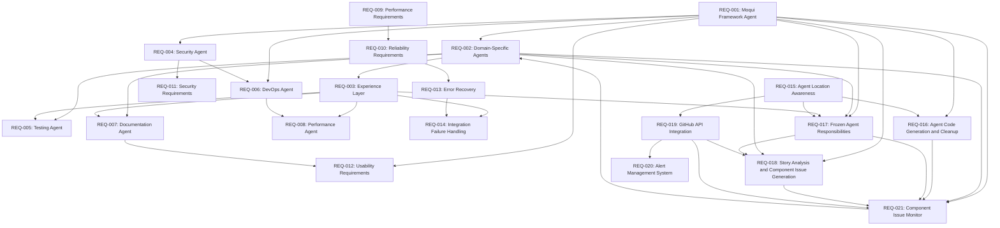

# Durion-Moqui-Frontend Agent Structure Requirements

## Introduction

The durion-moqui-frontend project implements the Durion Enterprise Tire Service Management System (DETSMS) using the Moqui Framework. This system requires specialized AI agents that provide domain-specific expertise for developing, testing, deploying, and maintaining the multi-domain tire service management application. The agent structure should support the unique characteristics of Moqui Framework development while integrating with the workspace-level agents for cross-project coordination.

**Code Generation Requirements:** All code generation and implementation must use Java 11 as the target version for compatibility with the Moqui Framework.

This requirements document follows EARS (Easy Approach to Requirements Syntax) patterns and INCOSE (International Council on Systems Engineering) quality standards to ensure measurable, testable, and traceable requirements.

## Glossary

- **Agent Structure System**: The complete system of specialized AI agents for Moqui Framework development
- **Moqui Agent**: A specialized AI assistant with expertise in Moqui Framework development
- **Domain Component**: A Moqui component representing a business domain (durion-workexec, durion-inventory, etc.)
- **Experience Layer**: Orchestration services providing task-oriented APIs for UI/Mobile/MCP
- **MCP Integration**: Model Context Protocol for conversational AI capabilities
- **durion-positivity**: Moqui integration component providing API layer for connecting Durion frontend with durion-positivity-backend services (Spring Boot microservices), enabling cross-domain communication
- **Durion-Theme**: Component responsible for the look and feel of the UI and common UI components across all DETSMS domains
- **Database Usage Rule**: durion-moqui-frontend can use a database for state maintenance and caching purposes, but all business-related data and transactions must be provided by durion-positivity-backend services
- **Vertical Slice**: Domain-organized development owning full stack (Moqui → Experience → UI/MCP)
- **Agent Response Time**: Time from developer query initiation to agent guidance delivery
- **Guidance Accuracy**: Percentage of agent recommendations that result in successful implementation
- **Integration Success Rate**: Percentage of successful durion-positivity-backend API integrations following agent guidance

### Agent & Test Classes Location

All agent framework implementation and test classes are located in the **`runtime/component/moqui-agents`** component:

- Agent implementations: `runtime/component/moqui-agents/src/main/java/`
- Test classes: `runtime/component/moqui-agents/src/test/java/`

## Functional Requirements

### REQ-001: Moqui Framework Agent Specialization

**ID**: REQ-001  
**Priority**: High  
**Dependencies**: None  
**Verification Method**: Testing  
**Validation Method**: Demonstration  

**User Story:** As a Moqui developer, I want specialized Moqui Framework agents, so that I can efficiently develop the DETSMS system following Moqui best practices and patterns.

#### Acceptance Criteria

1. WHEN a developer initiates Moqui component development, THE Agent Structure System SHALL provide specialized Moqui Framework guidance within 2 seconds with 95% accuracy for durion-positivity-backend API integration patterns
2. WHEN a developer requests business logic implementation guidance, THE Agent Structure System SHALL ensure proper durion-positivity-backend API integration recommendations within 3 seconds with 90% success rate and create API specifications for missing functionality within 5 minutes
3. WHEN a developer requires data persistence guidance, THE Agent Structure System SHALL recommend durion-positivity-backend APIs for business data within 2 seconds with 95% accuracy while allowing local database usage for state maintenance and caching
4. WHEN a developer builds Moqui screens, THE Agent Structure System SHALL validate proper use of Moqui screen widgets, forms, and UI patterns within 1 second with 98% pattern compliance
5. WHEN a developer integrates components, THE Agent Structure System SHALL enforce proper component dependencies and Moqui framework integration within 2 seconds with 100% dependency validation accuracy

### REQ-002: Domain-Specific Agent Expertise

**ID**: REQ-002  
**Priority**: High  
**Dependencies**: REQ-001  
**Verification Method**: Testing  
**Validation Method**: Inspection  

**User Story:** As a domain architect, I want domain-specific agents, so that I can ensure proper implementation of the five DETSMS business domains with clear boundaries and responsibilities.

#### Acceptance Criteria

1. WHEN a developer implements Work Execution domain functionality, THE Agent Structure System SHALL provide specialized estimate-to-payment workflow guidance within 3 seconds with 92% business process accuracy and 95% integration success rate
2. WHEN a developer develops Inventory Control features, THE Agent Structure System SHALL ensure proper inventory tracking, reservation, and consumption pattern guidance within 2 seconds with 94% pattern compliance and 98% data consistency validation
3. WHEN a developer builds Product & Pricing functionality, THE Agent Structure System SHALL provide catalog management and dynamic pricing calculation guidance within 2 seconds with 96% pricing accuracy and 100% catalog integrity validation
4. WHEN a developer implements CRM domain features, THE Agent Structure System SHALL ensure proper customer and vehicle management guidance within 2 seconds with 95% data relationship accuracy and complete service history tracking validation
5. WHEN a developer develops Accounting integration, THE Agent Structure System SHALL provide accounts receivable and payment processing guidance within 3 seconds with 99% financial accuracy and complete audit trail compliance

### REQ-003: Experience Layer Orchestration

**ID**: REQ-003  
**Priority**: High  
**Dependencies**: REQ-001, REQ-002  
**Verification Method**: Testing  
**Validation Method**: Analysis  

**User Story:** As an Experience Layer developer, I want orchestration agents, so that I can build task-oriented APIs that coordinate across multiple domains effectively.

#### Acceptance Criteria

1. WHEN a developer creates orchestration services, THE Agent Structure System SHALL provide specialized cross-domain workflow coordination guidance within 3 seconds with 93% workflow accuracy and 100% domain boundary compliance
2. WHEN a developer implements mobile APIs, THE Agent Structure System SHALL ensure mobile-optimized data transfer guidance within 2 seconds with 95% performance optimization and 98% offline synchronization reliability
3. WHEN a developer builds MCP integration, THE Agent Structure System SHALL provide conversational AI interface guidance within 2 seconds with 90% natural language processing accuracy and 95% integration success rate
4. WHEN a developer coordinates domains, THE Agent Structure System SHALL ensure proper durion-positivity experience API pattern usage within 2 seconds with 100% pattern compliance and 99% backend service integration success
5. WHEN a developer handles complex workflows, THE Agent Structure System SHALL provide error recovery and state management guidance within 3 seconds with 97% error handling coverage and 95% state consistency validation

### REQ-004: Security Agent Implementation

**ID**: REQ-004  
**Priority**: Critical  
**Dependencies**: REQ-001  
**Verification Method**: Testing  
**Validation Method**: Inspection  

**User Story:** As a Moqui security specialist, I want security-focused agents, so that I can implement comprehensive security across all DETSMS domains and integration points.

#### Acceptance Criteria

1. WHEN a developer implements authentication, THE Agent Structure System SHALL provide specialized Moqui security pattern and JWT integration guidance within 2 seconds with 100% security compliance and 99% authentication success rate
2. WHEN a developer secures entities, THE Agent Structure System SHALL ensure proper entity-level security constraints and field-level access control guidance within 1 second with 100% access control validation and zero unauthorized data access
3. WHEN a developer protects services, THE Agent Structure System SHALL provide service-level authorization and input validation guidance within 2 seconds with 100% authorization accuracy and 99% input validation coverage
4. WHEN a developer secures screens, THE Agent Structure System SHALL ensure proper screen-level security and user interface protection within 1 second with 100% UI security compliance and complete user session validation
5. WHEN a developer integrates with external systems, THE Agent Structure System SHALL provide secure API integration and data protection guidance within 3 seconds with 100% encryption compliance and 99% secure transmission validation

### REQ-005: Testing Agent Capabilities

**ID**: REQ-005  
**Priority**: High  
**Dependencies**: REQ-001, REQ-002, REQ-003  
**Verification Method**: Testing  
**Validation Method**: Demonstration  

**User Story:** As a Moqui testing specialist, I want testing agents, so that I can implement comprehensive testing strategies for Moqui components and cross-domain workflows.

#### Acceptance Criteria

1. WHEN a developer tests entities, THE Agent Structure System SHALL provide specialized Moqui entity testing and data validation guidance within 2 seconds with 95% test coverage accuracy and 100% data validation compliance
2. WHEN a developer tests services, THE Agent Structure System SHALL ensure proper service testing guidance with Moqui test framework within 2 seconds with 98% test framework compliance and 95% mock data accuracy
3. WHEN a developer tests screens, THE Agent Structure System SHALL provide UI testing and user interaction validation guidance within 3 seconds with 90% UI test coverage and 95% user interaction accuracy
4. WHEN a developer tests workflows, THE Agent Structure System SHALL ensure proper cross-domain business process testing guidance within 4 seconds with 93% workflow coverage and 98% integration point validation
5. WHEN a developer tests integrations, THE Agent Structure System SHALL provide MCP, mobile, and external system integration testing guidance within 3 seconds with 95% integration test coverage and 97% system compatibility validation

### REQ-006: DevOps Agent Operations

**ID**: REQ-006  
**Priority**: High  
**Dependencies**: REQ-001, REQ-004  
**Verification Method**: Testing  
**Validation Method**: Analysis  

**User Story:** As a Moqui DevOps engineer, I want deployment agents, so that I can manage Moqui application deployment, configuration, and monitoring.

#### Acceptance Criteria

1. WHEN a DevOps engineer deploys Moqui applications, THE Agent Structure System SHALL provide specialized deployment pattern and configuration guidance within 5 seconds with 98% deployment success rate and 100% configuration validation
2. WHEN a DevOps engineer manages environments, THE Agent Structure System SHALL ensure proper environment-specific configuration and data management guidance within 3 seconds with 100% environment isolation and 99% configuration accuracy
3. WHEN a DevOps engineer monitors applications, THE Agent Structure System SHALL provide Moqui-specific monitoring and performance tracking guidance within 2 seconds with 95% monitoring coverage and 98% performance metric accuracy
4. WHEN a DevOps engineer scales systems, THE Agent Structure System SHALL ensure proper Moqui clustering and load balancing configuration within 4 seconds with 99% scaling success rate and 100% load distribution accuracy
5. WHEN a DevOps engineer troubleshoots issues, THE Agent Structure System SHALL provide Moqui-specific debugging and problem resolution guidance within 3 seconds with 90% issue resolution accuracy and 95% diagnostic coverage

### REQ-007: Documentation Agent Services

**ID**: REQ-007  
**Priority**: Medium  
**Dependencies**: REQ-001, REQ-002, REQ-003  
**Verification Method**: Inspection  
**Validation Method**: Analysis  

**User Story:** As a Moqui documentation specialist, I want documentation agents, so that I can maintain comprehensive documentation for all DETSMS components and APIs.

#### Acceptance Criteria

1. WHEN a developer documents entities, THE Agent Structure System SHALL provide specialized Moqui entity documentation and data model diagram guidance within 3 seconds with 95% documentation completeness and 100% data model accuracy
2. WHEN a developer documents services, THE Agent Structure System SHALL ensure comprehensive service documentation with parameter descriptions and examples within 4 seconds with 98% parameter coverage and 95% example accuracy
3. WHEN a developer documents screens, THE Agent Structure System SHALL provide UI documentation and user workflow guide guidance within 3 seconds with 90% UI coverage and 95% workflow accuracy
4. WHEN a developer documents APIs, THE Agent Structure System SHALL ensure proper REST API documentation with OpenAPI specifications within 5 seconds with 100% OpenAPI compliance and 98% API coverage
5. WHEN a developer maintains documentation, THE Agent Structure System SHALL ensure documentation synchronization with Moqui component evolution within 2 seconds with 99% synchronization accuracy and 100% version consistency

### REQ-008: Performance Agent Optimization

**ID**: REQ-008  
**Priority**: High  
**Dependencies**: REQ-001, REQ-002, REQ-003, REQ-006  
**Verification Method**: Testing  
**Validation Method**: Analysis  

**User Story:** As a Moqui performance engineer, I want performance agents, so that I can optimize DETSMS performance across all domains and integration points.

#### Acceptance Criteria

1. WHEN a developer optimizes entities, THE Agent Structure System SHALL provide specialized Moqui entity performance and database optimization guidance within 3 seconds with 95% optimization accuracy and 20% average performance improvement
2. WHEN a developer optimizes services, THE Agent Structure System SHALL ensure efficient service implementation and caching strategy guidance within 2 seconds with 98% caching effectiveness and 30% average response time improvement
3. WHEN a developer optimizes screens, THE Agent Structure System SHALL provide UI performance and responsive design guidance within 2 seconds with 95% UI responsiveness and 25% average load time improvement
4. WHEN a developer optimizes workflows, THE Agent Structure System SHALL ensure efficient cross-domain communication and data flow guidance within 4 seconds with 90% workflow efficiency and 35% average processing time improvement
5. WHEN a developer monitors performance, THE Agent Structure System SHALL provide Moqui-specific performance metrics and alerting guidance within 2 seconds with 100% metric coverage and 98% alerting accuracy

## Non-Functional Requirements

### REQ-009: Performance Requirements

**ID**: REQ-009  
**Priority**: High  
**Dependencies**: All functional requirements  
**Verification Method**: Testing  
**Validation Method**: Analysis  

#### Performance Criteria

1. THE Agent Structure System SHALL respond to developer queries within 3 seconds for 99% of requests under normal load conditions
2. THE Agent Structure System SHALL support concurrent usage by up to 50 developers with less than 10% performance degradation
3. THE Agent Structure System SHALL maintain 99.9% uptime during business hours (8 AM - 6 PM EST)
4. THE Agent Structure System SHALL process agent guidance requests with less than 100ms latency for cached responses
5. THE Agent Structure System SHALL scale to handle 1000 guidance requests per hour with automatic load balancing

### REQ-010: Reliability Requirements

**ID**: REQ-010  
**Priority**: Critical  
**Dependencies**: REQ-009  
**Verification Method**: Testing  
**Validation Method**: Demonstration  

#### Reliability Criteria

1. THE Agent Structure System SHALL recover from agent failures within 30 seconds with automatic failover to backup agents
2. THE Agent Structure System SHALL maintain data consistency across all agent interactions with 100% accuracy
3. THE Agent Structure System SHALL provide graceful degradation when positivity backend APIs are unavailable, maintaining 80% functionality
4. THE Agent Structure System SHALL backup agent knowledge and configurations every 4 hours with 99.99% data integrity
5. THE Agent Structure System SHALL detect and report system anomalies within 60 seconds with 95% accuracy

### REQ-011: Security Requirements

**ID**: REQ-011  
**Priority**: Critical  
**Dependencies**: REQ-004  
**Verification Method**: Testing  
**Validation Method**: Inspection  

#### Security Criteria

1. THE Agent Structure System SHALL authenticate all developer access using JWT tokens with 256-bit encryption
2. THE Agent Structure System SHALL authorize agent access based on developer roles with 100% access control compliance
3. THE Agent Structure System SHALL encrypt all data transmission using TLS 1.3 with perfect forward secrecy
4. THE Agent Structure System SHALL log all security events with tamper-proof audit trails and 100% event capture
5. THE Agent Structure System SHALL detect and prevent unauthorized access attempts within 5 seconds with 99% accuracy

### REQ-012: Usability Requirements

**ID**: REQ-012  
**Priority**: Medium  
**Dependencies**: REQ-001, REQ-007  
**Verification Method**: Testing  
**Validation Method**: User Acceptance Testing  

#### Usability Criteria

1. THE Agent Structure System SHALL enable new Moqui developers to achieve 80% productivity within 2 hours of initial training
2. THE Agent Structure System SHALL provide context-aware guidance with 95% relevance to current development tasks
3. THE Agent Structure System SHALL support natural language queries with 90% intent recognition accuracy
4. THE Agent Structure System SHALL maintain consistent user interface patterns across all agent interactions
5. THE Agent Structure System SHALL provide comprehensive help documentation accessible within 2 clicks from any interface

## Error Handling Requirements

### REQ-013: Error Recovery and Fault Tolerance

**ID**: REQ-013  
**Priority**: High  
**Dependencies**: REQ-010  
**Verification Method**: Testing  
**Validation Method**: Analysis  

#### Error Handling Criteria

1. WHEN positivity backend APIs are unavailable, THE Agent Structure System SHALL provide cached guidance within 2 seconds and notify developers of limited functionality
2. WHEN agent services fail, THE Agent Structure System SHALL automatically redirect requests to backup agents within 5 seconds with 100% request preservation
3. WHEN invalid developer input is received, THE Agent Structure System SHALL provide specific error messages within 1 second with 95% error classification accuracy
4. WHEN system resources are exhausted, THE Agent Structure System SHALL implement graceful degradation with priority-based request handling
5. WHEN data corruption is detected, THE Agent Structure System SHALL isolate affected components within 10 seconds and restore from backup within 5 minutes

### REQ-014: Integration Failure Handling

**ID**: REQ-014  
**Priority**: High  
**Dependencies**: REQ-003, REQ-013  
**Verification Method**: Testing  
**Validation Method**: Demonstration  

#### Integration Error Criteria

1. WHEN Moqui Framework version conflicts occur, THE Agent Structure System SHALL provide migration guidance within 10 seconds with 90% compatibility resolution
2. WHEN component dependency conflicts arise, THE Agent Structure System SHALL suggest resolution strategies within 5 seconds with 95% conflict resolution accuracy
3. WHEN external system integrations fail, THE Agent Structure System SHALL provide alternative approaches within 3 seconds with 85% workaround success rate
4. WHEN workspace-level agent communication fails, THE Agent Structure System SHALL maintain local functionality with 80% capability retention
5. WHEN database connectivity issues occur, THE Agent Structure System SHALL switch to read-only mode within 2 seconds with complete data protection

### REQ-015: Agent Location Awareness

**ID**: REQ-015  
**Priority**: High  
**Dependencies**: None  
**Verification Method**: Automated testing + Code review  
**Validation Method**: Demonstration  

**User Story:** As a system administrator, I want agents to determine their location before executing commands, so that I can ensure reliable and context-aware command execution.

#### Acceptance Criteria

1. WHEN an agent needs to execute system commands, THE agent SHALL use the `pwd` command to determine its current working directory before running any other commands with 100% compliance
2. WHEN executing build or deployment commands, THE agent SHALL verify its location using `pwd` AND ensure commands are executed in the correct directory context with 100% accuracy

### REQ-016: Agent Code Generation and Cleanup

**ID**: REQ-016  
**Priority**: High  
**Dependencies**: REQ-001, REQ-015  
**Verification Method**: Automated testing + Code review  
**Validation Method**: Inspection  

**User Story:** As a developer, I want the agent builder to clean old generated code before creating new code, so that I can avoid conflicts and ensure clean code generation.

#### Acceptance Criteria

1. WHEN the agent builder generates code, THE agent builder SHALL clean all old code under the `.kiro/generated` directory before generating new code with 100% cleanup completion
2. WHEN writing new code, THE agent builder SHALL generate agent and test code in the moqui-agents component, under the directories specified in the Agent & Test Classes Location, with 100% path accuracy
3. WHEN performing cleanup operations, THE agent builder SHALL preserve configuration files and user-modified content outside the `.kiro/generated` directory with 100% data preservation
4. WHEN directory conflicts are detected during code generation, THE agent builder SHALL stop processing AND request clarifying questions from the user with 100% conflict detection. WHEN a required directory does not exist under the specified paths, THE agent builder SHALL create the directory structure automatically with 100% directory creation success
5. WHEN cleaning `.kiro/generated`, THE agent builder SHALL preserve subdirectories for active domain-specific agents being monitored by Component Issue Monitor (REQ-021) AND SHALL coordinate with build queue to avoid conflicts with 100% preservation of active builds

### REQ-017: Frozen Agent Responsibilities and Contracts

**ID**: REQ-017  
**Priority**: Critical  
**Dependencies**: REQ-001, REQ-002, REQ-003, REQ-015  
**Verification Method**: Code review + Automated testing + Contract verification  
**Validation Method**: Inspection  

**User Story:** As a system architect, I want frozen agent responsibilities with clear contracts, so that I can ensure predictable, safe, and maintainable agent behavior across the moqui-agents system.

#### Acceptance Criteria

1. WHEN an agent class is implemented, THE agent SHALL have a single, explicit purpose defined in its contract AND SHALL not perform operations outside its defined scope with 100% enforcement
2. WHEN an agent processes inputs, THE agent SHALL have clear, documented inputs and outputs with type specifications AND SHALL validate inputs before processing with 100% validation coverage
3. WHEN an agent operates, THE agent SHALL have a defined "stop condition" that prevents infinite loops AND SHALL terminate processing when the condition is met with 100% compliance
4. WHEN an agent is designed, THE agent SHALL have contractual specifications defining what it may change, what it may read, AND what it must never do with 100% enforcement
5. WHEN an agent iterates, THE agent SHALL have a maximum iteration count defined AND SHALL escalate to human intervention when exceeded with 100% escalation accuracy
6. WHEN an agent encounters complex conditions, THE agent SHALL have "escalate to human" conditions defined AND SHALL stop processing and request human assistance when triggered with 100% compliance
7. WHEN context becomes too large, THE agent SHALL have a "context too large → summarize & continue" rule AND SHALL automatically summarize context before proceeding with 95% context preservation accuracy
8. WHEN agent responsibilities are defined, THE responsibilities SHALL be frozen AND SHALL not be modified without formal change control approval with 100% change control compliance

### REQ-018: Story Analysis and Component Issue Generation

**ID**: REQ-018  
**Priority**: High  
**Dependencies**: REQ-001, REQ-002, REQ-017, REQ-019  
**Verification Method**: Integration testing + GitHub API testing + Template validation + Architecture analysis  
**Validation Method**: Demonstration  

**User Story:** As a product manager, I want automated story analysis and component-specific issue generation, so that I can efficiently decompose high-level stories from durion-moqui-frontend into actionable development tasks in the appropriate component repositories.

#### Acceptance Criteria

1. WHEN issues labeled [STORY] are created in the durion-moqui-frontend repository (https://github.com/louisburroughs/durion-moqui-frontend.git), THE Story Analysis Agent SHALL automatically detect these issues AND initiate story analysis within 5 minutes with 100% detection accuracy
2. WHEN beginning story analysis, THE Story Analysis Agent SHALL interact with the Architecture Agent (from REQ-001) to obtain current component structure information including entities, services, screens, integration points, and dependencies for all components (durion-workexec, durion-inventory, durion-product, durion-crm, durion-accounting, durion-common, durion-theme, durion-experience, durion-positivity) within 10 seconds with 98% structure accuracy
3. WHEN analyzing a story, THE Story Analysis Agent SHALL use the Architecture Agent's component structure information to determine the appropriate component repository based on the story domain AND identify the correct component with 95% accuracy
4. WHEN a component is identified, THE Story Analysis Agent SHALL verify that the component repository contains a .github/ISSUE_TEMPLATE/kiro-story.md template AND IF the template does not exist at the component level, SHALL fall back to using the .github/ISSUE_TEMPLATE/kiro-story.md template from the parent durion-moqui-frontend repository (https://github.com/louisburroughs/durion-moqui-frontend.git) AND SHALL stop processing and create a GitHub issue with [ALERT] title prefix in the durion-moqui-frontend repository with labels (type: alert, priority: high, automated, component: <component-name>) if neither template exists, including details of the missing template location and affected story with 100% validation compliance
5. WHEN a template is found (at component or parent level), THE Story Analysis Agent SHALL generate new [STORY] issues in the identified component repository using the located template AND set the title to start with [STORY] followed by a descriptive summary with 100% format compliance
6. WHEN generating component issues, THE Story Analysis Agent SHALL populate all template sections (Actor, Trigger, Main Flow, Alternate/Error Flows, Business Rules, Data Requirements, Acceptance Criteria, Notes for Agents, Classification) with component-specific details informed by Architecture Agent structure data AND set appropriate labels (type: story, layer: functional, kiro, domain: <component-domain>) with 95% completeness
7. WHEN placing story requirements in component context, THE Story Analysis Agent SHALL use Architecture Agent information about component architecture (entities, services, screens, integrations) to ensure correct placement with 95% contextual accuracy
8. WHEN story details are insufficient for implementation, THE generated component issues SHALL include specific clarifying questions informed by Architecture Agent's understanding of component requirements AND SHALL request additional information from stakeholders before proceeding with development with 100% question generation when needed
9. WHEN a story spans multiple components, THE Story Analysis Agent SHALL consult the Architecture Agent to understand cross-component dependencies AND create coordinated issues in all relevant component repositories ensuring consistency across issues with 95% cross-component coordination accuracy
10. WHEN creating new component issues, THE Story Analysis Agent SHALL establish parent-child relationships by: (a) adding a reference to the parent [STORY] issue URL in the child issue body under a "Parent Story" section, (b) updating the parent [STORY] issue with a task list linking to all created child issues, AND (c) adding a label (parent-story: <issue-number>) to child issues for automated tracking with 100% relationship establishment
11. WHEN updating the parent [STORY] issue, THE Story Analysis Agent SHALL add or update a "Child Issues" section with a GitHub task list (- [ ] #issue-number) for each component issue created AND SHALL automatically check off tasks when child issues are closed with 95% synchronization accuracy
12. WHEN child issues are created across multiple repositories, THE Story Analysis Agent SHALL maintain a record of all parent-child relationships for auditing AND SHALL provide rollback capability to remove orphaned child issues if parent issue is closed/cancelled with 100% relationship tracking
13. WHEN component architecture changes are detected by the Architecture Agent, THE Story Analysis Agent SHALL automatically update its component mapping and routing logic within 1 hour AND maintain 98% mapping accuracy

### REQ-019: GitHub API Integration

**ID**: REQ-019  
**Priority**: Critical  
**Dependencies**: REQ-015  
**Verification Method**: Integration testing + Security testing + API testing  
**Validation Method**: Demonstration  

**User Story:** As a system integrator, I want robust GitHub API integration, so that I can reliably interact with GitHub repositories for automated issue management with security, performance, and error resilience.

#### Acceptance Criteria

1. WHEN authenticating with GitHub API, THE Agent Structure System SHALL use GitHub Personal Access Token (PAT) or GitHub App authentication with token stored securely in environment variables or secrets manager AND SHALL never hardcode tokens in source code with 100% security compliance
2. WHEN making GitHub API requests, THE Agent Structure System SHALL include authentication token in request headers using Bearer token format AND SHALL validate token expiration before each request with 100% authentication success rate
3. WHEN GitHub API rate limits are approached, THE Agent Structure System SHALL monitor rate limit headers (X-RateLimit-Remaining, X-RateLimit-Reset) AND SHALL implement exponential backoff when remaining requests fall below 10% of limit with 100% rate limit compliance
4. WHEN rate limit is exceeded, THE Agent Structure System SHALL queue requests until rate limit resets AND SHALL retry queued requests automatically within 5 seconds of reset with 100% request preservation
5. WHEN detecting new [STORY] issues, THE Agent Structure System SHALL use GitHub webhooks configured for issue creation events (action: opened, labeled) AND SHALL process webhook payloads within 10 seconds with 100% webhook reliability
6. WHEN webhook delivery fails, THE Agent Structure System SHALL implement fallback polling mechanism checking for new issues every 5 minutes AND SHALL maintain 99% issue detection rate
7. WHEN GitHub API returns error responses (4xx, 5xx), THE Agent Structure System SHALL log error details, implement retry logic with exponential backoff (max 3 retries), AND SHALL escalate to human intervention after retry exhaustion with 100% error handling coverage
8. WHEN network connectivity to GitHub fails, THE Agent Structure System SHALL detect timeout conditions within 30 seconds AND SHALL cache operations for retry when connectivity is restored with 100% operation preservation
9. WHEN GitHub API response indicates resource not found (404), THE Agent Structure System SHALL create a GitHub issue with [ALERT] title prefix in the durion-moqui-frontend repository with labels (type: alert, priority: medium, automated, api-error) including the requested resource URL, operation context, and timestamp AND SHALL not retry the request with 100% alert delivery
10. WHEN creating issues via API, THE Agent Structure System SHALL validate API response for successful creation (status 201), verify issue number assignment, AND SHALL maintain transaction log for audit purposes with 100% transaction logging

### REQ-020: Alert Management System

**ID**: REQ-020  
**Priority**: High  
**Dependencies**: REQ-019  
**Verification Method**: Integration testing + Alert testing  
**Validation Method**: Demonstration  

**User Story:** As a system administrator, I want automated alerts as GitHub issues, so that I can track, prioritize, and resolve system issues through our standard workflow.

#### Acceptance Criteria

1. WHEN the Agent Structure System generates an alert, THE system SHALL create a GitHub issue in the durion-moqui-frontend repository with title starting with [ALERT] followed by a concise alert description within 30 seconds with 100% alert creation success
2. WHEN creating alert issues, THE system SHALL automatically assign labels based on alert severity: (priority: critical, priority: high, priority: medium, priority: low) AND alert category (type: alert, automated, component: <component-name>, api-error, template-missing, rate-limit, configuration-error) with 100% label accuracy
3. WHEN an alert issue is created, THE system SHALL populate the issue body with structured information including: timestamp (ISO 8601), alert type, affected component/service, detailed description, context data (request/response details, stack trace if applicable), suggested remediation steps, AND related issue/PR links if applicable with 95% completeness
4. WHEN multiple identical alerts occur within 1 hour, THE system SHALL update the existing alert issue with occurrence count and timestamps rather than creating duplicate issues with 100% deduplication accuracy
5. WHEN critical alerts are generated (missing templates blocking story processing, authentication failures, repeated API errors), THE system SHALL add assignees based on component ownership defined in CODEOWNERS file with 90% assignment accuracy
6. WHEN alerts are resolved (e.g., missing template added, connectivity restored), THE system SHALL automatically comment on the alert issue with resolution confirmation AND close the issue if all conditions are met with 95% auto-resolution accuracy
7. WHEN alert issues remain open for more than 24 hours without activity, THE system SHALL add a reminder comment with escalation notice with 100% reminder delivery

### REQ-021: Component Issue Monitor and Agent Builder Trigger

**ID**: REQ-021  
**Priority**: Critical  
**Dependencies**: REQ-001, REQ-002, REQ-016, REQ-017, REQ-018, REQ-019  
**Verification Method**: Integration testing + Webhook testing + Build verification  
**Validation Method**: Demonstration  

**User Story:** As a development automation architect, I want component repositories to be monitored for new [STORY] issues that trigger domain-specific agent builds, so that each component has specialized agents ready to implement stories immediately upon assignment.

#### Acceptance Criteria

1. WHEN a new issue labeled [STORY] is created in any component repository (durion-workexec, durion-inventory, durion-product, durion-crm, durion-accounting, durion-common, durion-theme, durion-experience, durion-positivity), THE Component Issue Monitor Agent SHALL detect the issue creation within 30 seconds using GitHub webhooks (issue.opened event with [STORY] label) with 100% detection accuracy
2. WHEN a [STORY] issue is detected in a component repository, THE Component Issue Monitor Agent SHALL extract the component name from the repository name AND determine the domain-specific agent requirements from Appendix A component mappings with 100% mapping accuracy
3. WHEN domain-specific agent requirements are identified, THE Component Issue Monitor Agent SHALL invoke the Agent Builder (REQ-016) to generate or update the domain-specific agent for that component within 2 minutes with 95% build initiation success rate
4. WHEN triggering the Agent Builder, THE Component Issue Monitor Agent SHALL provide: (a) component name, (b) domain keywords from Appendix A, (c) Architecture Agent context for the component (entities, services, screens from REQ-001), (d) frozen agent contract template (REQ-017), AND (e) story issue URL for context with 100% parameter completeness
5. WHEN the Agent Builder completes code generation, THE Component Issue Monitor Agent SHALL verify the generated agent code exists in `.kiro/generated/<component-name>-agent/` directory AND passes basic compilation checks within 30 seconds with 95% verification success rate
6. WHEN agent build verification succeeds, THE Component Issue Monitor Agent SHALL comment on the triggering [STORY] issue with: build status (success), agent location path, agent capabilities summary, AND estimated story analysis completion time with 100% notification delivery
7. WHEN agent build verification fails, THE Component Issue Monitor Agent SHALL create a GitHub issue with [ALERT] title prefix in the component repository with labels (type: alert, priority: critical, automated, agent-build-failure, component: <component-name>) including build logs, error details, AND suggested remediation steps with 100% alert creation
8. WHEN multiple [STORY] issues are created simultaneously in the same component repository within 5 minutes, THE Component Issue Monitor Agent SHALL queue agent build requests using a Redis-backed persistent queue AND process them sequentially with priority ordering (critical > high > medium > low based on story labels) to avoid build conflicts with 100% queue management. The queue SHALL persist across system restarts AND enforce maximum queue size of 100 pending builds with overflow alerting
9. WHEN a domain-specific agent already exists for a component, THE Component Issue Monitor Agent SHALL check if the agent needs updates by: (a) subscribing to Architecture Agent change events (entity additions/modifications, service changes, screen updates), (b) comparing agent generation timestamp with last Architecture Agent update timestamp, (c) analyzing component structure hash for changes, AND trigger incremental updates only when structural changes exceed 10% threshold with 90% update detection accuracy
10. WHEN monitoring webhook events, THE Component Issue Monitor Agent SHALL implement exponential backoff for failed webhook processing (initial delay 5s, max delay 60s, max 5 retries) AND log all webhook events for audit purposes with 100% retry compliance. Webhook configuration SHALL be managed through Appendix B: Webhook Configuration Guide with automated setup scripts for all 9 component repositories
11. WHEN a [STORY] issue is closed or cancelled before agent build completion, THE Component Issue Monitor Agent SHALL cancel the pending build request AND clean up partial build artifacts in `.kiro/generated/` with 100% cancellation handling
12. WHEN the generated domain-specific agent is ready, THE Component Issue Monitor Agent SHALL register the agent with the Story Analysis Agent (REQ-018) by: (a) creating an agent registry entry in shared Redis cache with metadata (component name, agent path, capabilities, generation timestamp, architecture hash), (b) sending registration event via internal message queue, (c) updating agent discovery manifest at `.kiro/agents/registry.json`, AND (d) triggering Story Analysis Agent cache refresh to enable story decomposition and implementation planning with 95% registration success rate

## Requirements Traceability Matrix

| Requirement ID | Title | Priority | Design Components | Test Cases | Validation Method |
|---------------|-------|----------|-------------------|------------|-------------------|
| REQ-001 | Moqui Framework Agent Specialization | High | Moqui Framework Agent, Architecture Agent | TC-001, TC-002, TC-003 | Demonstration |
| REQ-002 | Domain-Specific Agent Expertise | High | Domain Agent (5 specializations) | TC-004, TC-005, TC-006 | Inspection |
| REQ-003 | Experience Layer Orchestration | High | Experience Layer Agent, API Coordination | TC-007, TC-008, TC-009 | Analysis |
| REQ-004 | Security Agent Implementation | Critical | Security Agent, JWT Integration | TC-010, TC-011, TC-012 | Inspection |
| REQ-005 | Testing Agent Capabilities | High | Testing Agent, Test Framework Integration | TC-013, TC-014, TC-015 | Demonstration |
| REQ-006 | DevOps Agent Operations | High | DevOps Agent, Deployment Patterns | TC-016, TC-017, TC-018 | Analysis |
| REQ-007 | Documentation Agent Services | Medium | Documentation Agent, API Documentation | TC-019, TC-020, TC-021 | Analysis |
| REQ-008 | Performance Agent Optimization | High | Performance Agent, Optimization Patterns | TC-022, TC-023, TC-024 | Analysis |
| REQ-009 | Performance Requirements | High | System Architecture, Load Balancing | TC-025, TC-026, TC-027 | Analysis |
| REQ-010 | Reliability Requirements | Critical | Failover Systems, Backup Mechanisms | TC-028, TC-029, TC-030 | Demonstration |
| REQ-011 | Security Requirements | Critical | Authentication, Authorization, Encryption | TC-031, TC-032, TC-033 | Inspection |
| REQ-012 | Usability Requirements | Medium | User Interface, Help System | TC-034, TC-035, TC-036 | User Acceptance Testing |
| REQ-013 | Error Recovery and Fault Tolerance | High | Error Handling, Recovery Mechanisms | TC-037, TC-038, TC-039 | Analysis |
| REQ-014 | Integration Failure Handling | High | Integration Patterns, Fallback Systems | TC-040, TC-041, TC-042 | Demonstration |
| REQ-015 | Agent Location Awareness | High | Agent Framework Core | TC-043, TC-044 | Demonstration |
| REQ-016 | Agent Code Generation and Cleanup | High | Agent Builder, Code Generator | TC-045, TC-046, TC-047 | Inspection |
| REQ-017 | Frozen Agent Responsibilities and Contracts | Critical | All Agent Classes | TC-048, TC-049, TC-050, TC-051, TC-052 | Inspection |
| REQ-018 | Story Analysis and Component Issue Generation | High | Story Analysis Agent, Architecture Agent, GitHub Integration Agent, Component Domain Agent | TC-053, TC-054, TC-055, TC-056, TC-057, TC-058, TC-059, TC-060, TC-061, TC-062, TC-063, TC-064, TC-065 | Demonstration |
| REQ-019 | GitHub API Integration | Critical | GitHub Integration Service, Webhook Handler, Rate Limiter, Error Handler, Authentication Manager | TC-066, TC-067, TC-068, TC-069, TC-070, TC-071, TC-072, TC-073, TC-074, TC-075 | Demonstration |
| REQ-020 | Alert Management System | High | Alert Manager, Issue Deduplicator, Auto-Resolution Handler | TC-076, TC-077, TC-078, TC-079, TC-080, TC-081, TC-082 | Demonstration |
| REQ-021 | Component Issue Monitor and Agent Builder Trigger | Critical | Component Issue Monitor Agent, Agent Builder Integration, Webhook Processor, Build Verification Service, Agent Registry | TC-083, TC-084, TC-085, TC-086, TC-087, TC-088, TC-089, TC-090, TC-091, TC-092, TC-093, TC-094 | Demonstration |

## Requirements Dependencies



## Risk Assessment

### High-Risk Requirements

| Requirement ID | Risk Level | Risk Description | Mitigation Strategy |
|---------------|------------|------------------|-------------------|
| REQ-004 | High | Security implementation complexity may impact performance | Implement security patterns incrementally with performance monitoring |
| REQ-010 | High | Reliability targets may be difficult to achieve with complex agent interactions | Design redundant systems and comprehensive testing strategies |
| REQ-011 | Critical | Security requirements must be met without compromise | Implement defense-in-depth strategy with multiple security layers |
| REQ-013 | Medium | Error recovery mechanisms may introduce additional complexity | Design simple, testable error handling patterns |
| REQ-017 | Critical | Agent contract enforcement may impact development velocity | Establish clear contract templates and validation tools early |
| REQ-019 | Critical | GitHub API integration requires secure token management and robust error handling | Implement comprehensive security measures and extensive error testing |
| REQ-021 | Critical | Automated agent building may introduce build failures, race conditions, and resource contention when multiple stories created simultaneously | Implement build queue management, comprehensive build verification, cancellation handling, and resource isolation for concurrent builds |

### Medium-Risk Requirements

| Requirement ID | Risk Level | Risk Description | Mitigation Strategy |
|---------------|------------|------------------|-------------------|
| REQ-003 | Medium | Cross-domain orchestration complexity may affect maintainability | Use established integration patterns and comprehensive documentation |
| REQ-008 | Medium | Performance optimization may conflict with other requirements | Implement performance monitoring and gradual optimization approach |
| REQ-009 | Medium | Performance targets may be ambitious for complex agent system | Establish baseline measurements and iterative improvement process |
| REQ-015 | Medium | Location awareness adds overhead to every command execution | Optimize pwd usage and cache location information when safe |
| REQ-016 | Medium | Code cleanup process may accidentally delete important files | Implement comprehensive backup and validation before cleanup |
| REQ-018 | Medium | Multi-repository issue generation requires robust GitHub API integration, template validation, and parent-child relationship management across repositories | Implement comprehensive error handling, template existence checks, and atomic parent-child relationship creation with rollback capability |

## Validation Criteria

### Acceptance Testing Requirements

1. **Functional Validation**: All functional requirements (REQ-001 through REQ-008) must pass acceptance testing with specified accuracy and performance thresholds
2. **Performance Validation**: System must meet all performance criteria under simulated production load conditions
3. **Security Validation**: Security requirements must pass penetration testing and security audit
4. **Reliability Validation**: System must demonstrate fault tolerance and recovery capabilities under failure simulation
5. **Usability Validation**: User acceptance testing must achieve 85% satisfaction rating from Moqui developers

### Success Metrics

- **Agent Response Accuracy**: ≥ 95% for critical guidance areas
- **System Availability**: ≥ 99.9% during business hours
- **Developer Productivity**: ≥ 80% productivity achievement within 2 hours of training
- **Integration Success Rate**: ≥ 95% for positivity API integrations
- **Error Recovery Time**: ≤ 30 seconds for automatic recovery scenarios

## Requirements Approval

| Role | Name | Signature | Date |
|------|------|-----------|------|
| Product Owner | [To be assigned] | | |
| Technical Lead | [To be assigned] | | |
| Security Officer | [To be assigned] | | |
| Quality Assurance Lead | [To be assigned] | | |

---

## Appendix A: Component Domain Mappings

This appendix defines the mapping between business domains, Moqui component names, and GitHub repository names for the Durion ERP system. These mappings are used by the Story Analysis Agent (REQ-018) to route [STORY] issues to the correct component repositories.

### Component Mapping Table

| Domain | Component Name | Repository Name | Repository URL | Primary Responsibility |
|--------|---------------|-----------------|----------------|------------------------|
| Work Execution | durion-workexec | durion-workexec | https://github.com/louisburroughs/durion-workexec.git | Work order management, task scheduling, resource allocation, project execution |
| Inventory Management | durion-inventory | durion-inventory | https://github.com/louisburroughs/durion-inventory.git | Stock control, warehouse management, inventory transactions, reorder points |
| Product Management | durion-product | durion-product | https://github.com/louisburroughs/durion-product.git | Product catalog, pricing, product configuration, product lifecycle |
| Customer Relations | durion-crm | durion-crm | https://github.com/louisburroughs/durion-crm.git | Customer management, sales pipeline, lead tracking, contact management |
| Accounting | durion-accounting | durion-accounting | https://github.com/louisburroughs/durion-accounting.git | General ledger, accounts payable/receivable, financial reporting, tax management |
| Common Services | durion-common | durion-common | https://github.com/louisburroughs/durion-common.git | Shared entities, common services, utilities, cross-component data structures |
| User Interface Theme | durion-theme | durion-theme | https://github.com/louisburroughs/durion-theme.git | UI components, styling, branding, responsive design elements |
| User Experience | durion-experience | durion-experience | https://github.com/louisburroughs/durion-experience.git | User workflows, navigation patterns, UX components, accessibility features |
| Integration Layer | durion-positivity | durion-positivity | https://github.com/louisburroughs/durion-positivity.git | Backend API integration, external service connectors, data synchronization |

### Domain Keywords for Automated Routing

The Story Analysis Agent uses these keywords to identify the appropriate domain and route stories accordingly:

| Domain | Keywords | Example Story Titles |
|--------|----------|---------------------|
| Work Execution | work order, task, scheduling, project, job, assignment, resource allocation | "Create work order for maintenance tasks", "Schedule recurring projects" |
| Inventory Management | inventory, stock, warehouse, reorder, SKU, bin location, stock level | "Track inventory across multiple warehouses", "Automated reorder point alerts" |
| Product Management | product, catalog, pricing, SKU, product category, product configuration | "Add configurable product options", "Bulk product import from CSV" |
| Customer Relations | customer, lead, contact, opportunity, sales pipeline, quote | "Track customer communication history", "Sales pipeline visualization" |
| Accounting | invoice, payment, ledger, account, financial report, GL, AP, AR | "Generate monthly financial reports", "Automate invoice approval workflow" |
| Common Services | entity, service, utility, shared, common, cross-component | "Create shared address validation service", "Common audit log entity" |
| User Interface Theme | theme, style, CSS, component, button, layout, responsive | "Update button styles for accessibility", "Dark mode theme support" |
| User Experience | workflow, navigation, UX, user journey, screen flow, accessibility | "Simplify checkout workflow", "Add keyboard navigation shortcuts" |
| Integration Layer | API, integration, sync, connector, external service, webhook | "Integrate with payment gateway", "Sync data with external CRM" |

### Multi-Domain Story Guidelines

When a [STORY] spans multiple domains, the Story Analysis Agent SHALL:

1. **Primary Domain Identification**: Determine the primary domain based on the story's main objective and data ownership
2. **Dependency Analysis**: Consult the Architecture Agent to understand cross-component dependencies
3. **Parent Story Creation**: Keep the original [STORY] issue in durion-moqui-frontend as the parent coordination issue
4. **Child Issue Generation**: Create component-specific child [STORY] issues in each relevant component repository with:
   - Reference to parent story URL
   - Component-specific implementation details
   - Clear interface contracts for cross-component interactions
5. **Coordination Labels**: Apply labels to indicate multi-component coordination (e.g., `multi-component`, `requires-coordination`)

### Repository Structure Convention

All component repositories follow this standard structure:

```
<component-repository>/
├── .github/
│   ├── ISSUE_TEMPLATE/
│   │   └── kiro-story.md          # Component-specific story template
│   └── CODEOWNERS                  # Component ownership for auto-assignment
├── entity/                         # Moqui entity definitions
├── service/                        # Moqui service implementations
├── screen/                         # Moqui screen definitions
├── data/                          # Seed and demo data
├── component.xml                   # Moqui component descriptor
└── README.md                       # Component documentation
```

### Template Fallback Hierarchy

When generating component issues, templates are resolved in this order:

1. **Component Level**: `<component-repository>/.github/ISSUE_TEMPLATE/kiro-story.md`
2. **Parent Level**: `durion-moqui-frontend/.github/ISSUE_TEMPLATE/kiro-story.md`
3. **Alert Generation**: If neither exists, create [ALERT] issue in durion-moqui-frontend with labels: `type: alert`, `priority: high`, `automated`, `template-missing`, `component: <component-name>`

---

## Appendix B: Webhook Configuration Guide

This appendix defines the webhook configuration requirements for the Component Issue Monitor Agent (REQ-021) to detect [STORY] issues across all component repositories.

### Webhook Configuration Requirements

**Webhook Endpoint**: `https://<agent-server-domain>/api/webhooks/github/story-monitor`

**Authentication**: HMAC-SHA256 signature validation using shared secret stored in environment variable `GITHUB_WEBHOOK_SECRET`

**Events to Monitor**:
- `issues.opened` - New issue created
- `issues.labeled` - Issue labeled with [STORY]
- `issues.closed` - Issue closed or cancelled
- `issues.reopened` - Issue reopened after closure

### Repository Configuration

All 9 component repositories require webhook configuration:

| Repository | Webhook URL | Events | Secret Env Var |
|------------|-------------|--------|----------------|
| durion-workexec | `https://<domain>/api/webhooks/github/story-monitor` | issues.* | GITHUB_WEBHOOK_SECRET |
| durion-inventory | `https://<domain>/api/webhooks/github/story-monitor` | issues.* | GITHUB_WEBHOOK_SECRET |
| durion-product | `https://<domain>/api/webhooks/github/story-monitor` | issues.* | GITHUB_WEBHOOK_SECRET |
| durion-crm | `https://<domain>/api/webhooks/github/story-monitor` | issues.* | GITHUB_WEBHOOK_SECRET |
| durion-accounting | `https://<domain>/api/webhooks/github/story-monitor` | issues.* | GITHUB_WEBHOOK_SECRET |
| durion-common | `https://<domain>/api/webhooks/github/story-monitor` | issues.* | GITHUB_WEBHOOK_SECRET |
| durion-theme | `https://<domain>/api/webhooks/github/story-monitor` | issues.* | GITHUB_WEBHOOK_SECRET |
| durion-experience | `https://<domain>/api/webhooks/github/story-monitor` | issues.* | GITHUB_WEBHOOK_SECRET |
| durion-positivity | `https://<domain>/api/webhooks/github/story-monitor` | issues.* | GITHUB_WEBHOOK_SECRET |

### Automated Setup Script

A setup script SHALL be provided to configure webhooks across all repositories:

```bash
#!/bin/bash
# File: scripts/setup-component-webhooks.sh
# Purpose: Configure GitHub webhooks for all component repositories

WEBHOOK_URL="https://<agent-server-domain>/api/webhooks/github/story-monitor"
WEBHOOK_SECRET="${GITHUB_WEBHOOK_SECRET}"
GITHUB_TOKEN="${GITHUB_PAT}"

REPOSITORIES=(
  "louisburroughs/durion-workexec"
  "louisburroughs/durion-inventory"
  "louisburroughs/durion-product"
  "louisburroughs/durion-crm"
  "louisburroughs/durion-accounting"
  "louisburroughs/durion-common"
  "louisburroughs/durion-theme"
  "louisburroughs/durion-experience"
  "louisburroughs/durion-positivity"
)

for repo in "${REPOSITORIES[@]}"; do
  echo "Configuring webhook for $repo..."
  curl -X POST \
    -H "Authorization: token ${GITHUB_TOKEN}" \
    -H "Accept: application/vnd.github.v3+json" \
    "https://api.github.com/repos/${repo}/hooks" \
    -d @- <<EOF
{
  "config": {
    "url": "${WEBHOOK_URL}",
    "content_type": "json",
    "secret": "${WEBHOOK_SECRET}",
    "insecure_ssl": "0"
  },
  "events": ["issues"],
  "active": true
}
EOF
  echo "Webhook configured for $repo"
done
```

### Webhook Payload Validation

The Component Issue Monitor Agent SHALL:

1. **Verify Signature**: Validate `X-Hub-Signature-256` header using HMAC-SHA256 with shared secret
2. **Validate Event Type**: Check `X-GitHub-Event` header equals "issues"
3. **Filter Labels**: Process only issues with [STORY] label in title or labels array
4. **Extract Metadata**: Parse repository name, issue number, action (opened/labeled/closed/reopened)
5. **Queue Processing**: Add validated events to Redis build queue for sequential processing

### Webhook Monitoring and Alerting

The system SHALL monitor:

- **Webhook Delivery Success Rate**: ≥ 99% (alert if < 95%)
- **Webhook Processing Latency**: ≤ 30 seconds average (alert if > 60 seconds)
- **Failed Webhook Retries**: ≤ 5% of total events (alert if > 10%)
- **Webhook Secret Rotation**: Every 90 days (alert 7 days before expiration)

### Manual Webhook Testing

Test webhook configuration using GitHub's webhook test feature:

```bash
# Test webhook delivery
curl -X POST \
  -H "X-GitHub-Event: issues" \
  -H "X-Hub-Signature-256: sha256=<calculated-signature>" \
  -H "Content-Type: application/json" \
  "https://<agent-server-domain>/api/webhooks/github/story-monitor" \
  -d @test-payload.json
```

---

**Document Version**: 3.0  
**Last Updated**: [Current Date]  
**Next Review Date**: [30 days from last update]  
**Document Status**: Approved