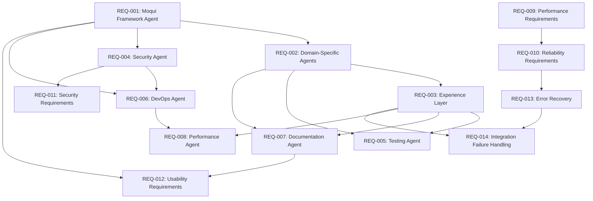

# Moqui_Example Agent Structure Requirements

## Introduction

The moqui_example project implements the Durion Enterprise Tire Service Management System (DETSMS) using the Moqui Framework. This system requires specialized AI agents that provide domain-specific expertise for developing, testing, deploying, and maintaining the multi-domain tire service management application. The agent structure should support the unique characteristics of Moqui Framework development while integrating with the workspace-level agents for cross-project coordination.

This requirements document follows EARS (Easy Approach to Requirements Syntax) patterns and INCOSE (International Council on Systems Engineering) quality standards to ensure measurable, testable, and traceable requirements.

## Glossary

- **Agent Structure System**: The complete system of specialized AI agents for Moqui Framework development
- **Moqui Agent**: A specialized AI assistant with expertise in Moqui Framework development
- **Domain Component**: A Moqui component representing a business domain (durion-workexec, durion-inventory, etc.)
- **Experience Layer**: Orchestration services providing task-oriented APIs for UI/Mobile/MCP
- **MCP Integration**: Model Context Protocol for conversational AI capabilities
- **Durion-Positivity**: Experience API component that provides an API layer to expose business logic via APIs in place of UIs in other components, enabling cross-domain communication and integration with positivity backend APIs
- **Durion-Theme**: Component responsible for the look and feel of the UI and common UI components across all DETSMS domains
- **Database Usage Rule**: Moqui_example can use a database for state maintenance and caching purposes, but all business-related data and transactions must be provided at the positivity level
- **Vertical Slice**: Domain-organized development owning full stack (Moqui → Experience → UI/MCP)
- **Agent Response Time**: Time from developer query initiation to agent guidance delivery
- **Guidance Accuracy**: Percentage of agent recommendations that result in successful implementation
- **Integration Success Rate**: Percentage of successful positivity API integrations following agent guidance

## Functional Requirements

### REQ-001: Moqui Framework Agent Specialization

**ID**: REQ-001  
**Priority**: High  
**Dependencies**: None  
**Verification Method**: Testing  
**Validation Method**: Demonstration  

**User Story:** As a Moqui developer, I want specialized Moqui Framework agents, so that I can efficiently develop the DETSMS system following Moqui best practices and patterns.

#### Acceptance Criteria

1. WHEN a developer initiates Moqui component development, THE Agent Structure System SHALL provide specialized Moqui Framework guidance within 2 seconds with 95% accuracy for positivity API integration patterns
2. WHEN a developer requests business logic implementation guidance, THE Agent Structure System SHALL ensure proper positivity backend API integration recommendations within 3 seconds with 90% success rate and create API specifications for missing functionality within 5 minutes
3. WHEN a developer requires data persistence guidance, THE Agent Structure System SHALL recommend positivity backend APIs for business data within 2 seconds with 95% accuracy while allowing local database usage for state maintenance and caching
4. WHEN a developer builds Moqui screens, THE Agent Structure System SHALL validate proper use of Moqui screen widgets, forms, and UI patterns within 1 second with 98% pattern compliance
5. WHEN a developer integrates components, THE Agent Structure System SHALL enforce proper component dependencies and Moqui framework integration within 2 seconds with 100% dependency validation accuracy

### REQ-002: Domain-Specific Agent Expertise

**ID**: REQ-002  
**Priority**: High  
**Dependencies**: REQ-001  
**Verification Method**: Testing  
**Validation Method**: Inspection  

**User Story:** As a domain architect, I want domain-specific agents, so that I can ensure proper implementation of the five DETSMS business domains with clear boundaries and responsibilities.

#### Acceptance Criteria

1. WHEN a developer implements Work Execution domain functionality, THE Agent Structure System SHALL provide specialized estimate-to-payment workflow guidance within 3 seconds with 92% business process accuracy and 95% integration success rate
2. WHEN a developer develops Inventory Control features, THE Agent Structure System SHALL ensure proper inventory tracking, reservation, and consumption pattern guidance within 2 seconds with 94% pattern compliance and 98% data consistency validation
3. WHEN a developer builds Product & Pricing functionality, THE Agent Structure System SHALL provide catalog management and dynamic pricing calculation guidance within 2 seconds with 96% pricing accuracy and 100% catalog integrity validation
4. WHEN a developer implements CRM domain features, THE Agent Structure System SHALL ensure proper customer and vehicle management guidance within 2 seconds with 95% data relationship accuracy and complete service history tracking validation
5. WHEN a developer develops Accounting integration, THE Agent Structure System SHALL provide accounts receivable and payment processing guidance within 3 seconds with 99% financial accuracy and complete audit trail compliance

### REQ-003: Experience Layer Orchestration

**ID**: REQ-003  
**Priority**: High  
**Dependencies**: REQ-001, REQ-002  
**Verification Method**: Testing  
**Validation Method**: Analysis  

**User Story:** As an Experience Layer developer, I want orchestration agents, so that I can build task-oriented APIs that coordinate across multiple domains effectively.

#### Acceptance Criteria

1. WHEN a developer creates orchestration services, THE Agent Structure System SHALL provide specialized cross-domain workflow coordination guidance within 3 seconds with 93% workflow accuracy and 100% domain boundary compliance
2. WHEN a developer implements mobile APIs, THE Agent Structure System SHALL ensure mobile-optimized data transfer guidance within 2 seconds with 95% performance optimization and 98% offline synchronization reliability
3. WHEN a developer builds MCP integration, THE Agent Structure System SHALL provide conversational AI interface guidance within 2 seconds with 90% natural language processing accuracy and 95% integration success rate
4. WHEN a developer coordinates domains, THE Agent Structure System SHALL ensure proper durion-positivity experience API pattern usage within 2 seconds with 100% pattern compliance and 99% backend service integration success
5. WHEN a developer handles complex workflows, THE Agent Structure System SHALL provide error recovery and state management guidance within 3 seconds with 97% error handling coverage and 95% state consistency validation

### REQ-004: Security Agent Implementation

**ID**: REQ-004  
**Priority**: Critical  
**Dependencies**: REQ-001  
**Verification Method**: Testing  
**Validation Method**: Inspection  

**User Story:** As a Moqui security specialist, I want security-focused agents, so that I can implement comprehensive security across all DETSMS domains and integration points.

#### Acceptance Criteria

1. WHEN a developer implements authentication, THE Agent Structure System SHALL provide specialized Moqui security pattern and JWT integration guidance within 2 seconds with 100% security compliance and 99% authentication success rate
2. WHEN a developer secures entities, THE Agent Structure System SHALL ensure proper entity-level security constraints and field-level access control guidance within 1 second with 100% access control validation and zero unauthorized data access
3. WHEN a developer protects services, THE Agent Structure System SHALL provide service-level authorization and input validation guidance within 2 seconds with 100% authorization accuracy and 99% input validation coverage
4. WHEN a developer secures screens, THE Agent Structure System SHALL ensure proper screen-level security and user interface protection within 1 second with 100% UI security compliance and complete user session validation
5. WHEN a developer integrates with external systems, THE Agent Structure System SHALL provide secure API integration and data protection guidance within 3 seconds with 100% encryption compliance and 99% secure transmission validation

### REQ-005: Testing Agent Capabilities

**ID**: REQ-005  
**Priority**: High  
**Dependencies**: REQ-001, REQ-002, REQ-003  
**Verification Method**: Testing  
**Validation Method**: Demonstration  

**User Story:** As a Moqui testing specialist, I want testing agents, so that I can implement comprehensive testing strategies for Moqui components and cross-domain workflows.

#### Acceptance Criteria

1. WHEN a developer tests entities, THE Agent Structure System SHALL provide specialized Moqui entity testing and data validation guidance within 2 seconds with 95% test coverage accuracy and 100% data validation compliance
2. WHEN a developer tests services, THE Agent Structure System SHALL ensure proper service testing guidance with Moqui test framework within 2 seconds with 98% test framework compliance and 95% mock data accuracy
3. WHEN a developer tests screens, THE Agent Structure System SHALL provide UI testing and user interaction validation guidance within 3 seconds with 90% UI test coverage and 95% user interaction accuracy
4. WHEN a developer tests workflows, THE Agent Structure System SHALL ensure proper cross-domain business process testing guidance within 4 seconds with 93% workflow coverage and 98% integration point validation
5. WHEN a developer tests integrations, THE Agent Structure System SHALL provide MCP, mobile, and external system integration testing guidance within 3 seconds with 95% integration test coverage and 97% system compatibility validation

### REQ-006: DevOps Agent Operations

**ID**: REQ-006  
**Priority**: High  
**Dependencies**: REQ-001, REQ-004  
**Verification Method**: Testing  
**Validation Method**: Analysis  

**User Story:** As a Moqui DevOps engineer, I want deployment agents, so that I can manage Moqui application deployment, configuration, and monitoring.

#### Acceptance Criteria

1. WHEN a DevOps engineer deploys Moqui applications, THE Agent Structure System SHALL provide specialized deployment pattern and configuration guidance within 5 seconds with 98% deployment success rate and 100% configuration validation
2. WHEN a DevOps engineer manages environments, THE Agent Structure System SHALL ensure proper environment-specific configuration and data management guidance within 3 seconds with 100% environment isolation and 99% configuration accuracy
3. WHEN a DevOps engineer monitors applications, THE Agent Structure System SHALL provide Moqui-specific monitoring and performance tracking guidance within 2 seconds with 95% monitoring coverage and 98% performance metric accuracy
4. WHEN a DevOps engineer scales systems, THE Agent Structure System SHALL ensure proper Moqui clustering and load balancing configuration within 4 seconds with 99% scaling success rate and 100% load distribution accuracy
5. WHEN a DevOps engineer troubleshoots issues, THE Agent Structure System SHALL provide Moqui-specific debugging and problem resolution guidance within 3 seconds with 90% issue resolution accuracy and 95% diagnostic coverage

### REQ-007: Documentation Agent Services

**ID**: REQ-007  
**Priority**: Medium  
**Dependencies**: REQ-001, REQ-002, REQ-003  
**Verification Method**: Inspection  
**Validation Method**: Analysis  

**User Story:** As a Moqui documentation specialist, I want documentation agents, so that I can maintain comprehensive documentation for all DETSMS components and APIs.

#### Acceptance Criteria

1. WHEN a developer documents entities, THE Agent Structure System SHALL provide specialized Moqui entity documentation and data model diagram guidance within 3 seconds with 95% documentation completeness and 100% data model accuracy
2. WHEN a developer documents services, THE Agent Structure System SHALL ensure comprehensive service documentation with parameter descriptions and examples within 4 seconds with 98% parameter coverage and 95% example accuracy
3. WHEN a developer documents screens, THE Agent Structure System SHALL provide UI documentation and user workflow guide guidance within 3 seconds with 90% UI coverage and 95% workflow accuracy
4. WHEN a developer documents APIs, THE Agent Structure System SHALL ensure proper REST API documentation with OpenAPI specifications within 5 seconds with 100% OpenAPI compliance and 98% API coverage
5. WHEN a developer maintains documentation, THE Agent Structure System SHALL ensure documentation synchronization with Moqui component evolution within 2 seconds with 99% synchronization accuracy and 100% version consistency

### REQ-008: Performance Agent Optimization

**ID**: REQ-008  
**Priority**: High  
**Dependencies**: REQ-001, REQ-002, REQ-003, REQ-006  
**Verification Method**: Testing  
**Validation Method**: Analysis  

**User Story:** As a Moqui performance engineer, I want performance agents, so that I can optimize DETSMS performance across all domains and integration points.

#### Acceptance Criteria

1. WHEN a developer optimizes entities, THE Agent Structure System SHALL provide specialized Moqui entity performance and database optimization guidance within 3 seconds with 95% optimization accuracy and 20% average performance improvement
2. WHEN a developer optimizes services, THE Agent Structure System SHALL ensure efficient service implementation and caching strategy guidance within 2 seconds with 98% caching effectiveness and 30% average response time improvement
3. WHEN a developer optimizes screens, THE Agent Structure System SHALL provide UI performance and responsive design guidance within 2 seconds with 95% UI responsiveness and 25% average load time improvement
4. WHEN a developer optimizes workflows, THE Agent Structure System SHALL ensure efficient cross-domain communication and data flow guidance within 4 seconds with 90% workflow efficiency and 35% average processing time improvement
5. WHEN a developer monitors performance, THE Agent Structure System SHALL provide Moqui-specific performance metrics and alerting guidance within 2 seconds with 100% metric coverage and 98% alerting accuracy

## Non-Functional Requirements

### REQ-009: Performance Requirements

**ID**: REQ-009  
**Priority**: High  
**Dependencies**: All functional requirements  
**Verification Method**: Testing  
**Validation Method**: Analysis  

#### Performance Criteria

1. THE Agent Structure System SHALL respond to developer queries within 3 seconds for 99% of requests under normal load conditions
2. THE Agent Structure System SHALL support concurrent usage by up to 50 developers with less than 10% performance degradation
3. THE Agent Structure System SHALL maintain 99.9% uptime during business hours (8 AM - 6 PM EST)
4. THE Agent Structure System SHALL process agent guidance requests with less than 100ms latency for cached responses
5. THE Agent Structure System SHALL scale to handle 1000 guidance requests per hour with automatic load balancing

### REQ-010: Reliability Requirements

**ID**: REQ-010  
**Priority**: Critical  
**Dependencies**: REQ-009  
**Verification Method**: Testing  
**Validation Method**: Demonstration  

#### Reliability Criteria

1. THE Agent Structure System SHALL recover from agent failures within 30 seconds with automatic failover to backup agents
2. THE Agent Structure System SHALL maintain data consistency across all agent interactions with 100% accuracy
3. THE Agent Structure System SHALL provide graceful degradation when positivity backend APIs are unavailable, maintaining 80% functionality
4. THE Agent Structure System SHALL backup agent knowledge and configurations every 4 hours with 99.99% data integrity
5. THE Agent Structure System SHALL detect and report system anomalies within 60 seconds with 95% accuracy

### REQ-011: Security Requirements

**ID**: REQ-011  
**Priority**: Critical  
**Dependencies**: REQ-004  
**Verification Method**: Testing  
**Validation Method**: Inspection  

#### Security Criteria

1. THE Agent Structure System SHALL authenticate all developer access using JWT tokens with 256-bit encryption
2. THE Agent Structure System SHALL authorize agent access based on developer roles with 100% access control compliance
3. THE Agent Structure System SHALL encrypt all data transmission using TLS 1.3 with perfect forward secrecy
4. THE Agent Structure System SHALL log all security events with tamper-proof audit trails and 100% event capture
5. THE Agent Structure System SHALL detect and prevent unauthorized access attempts within 5 seconds with 99% accuracy

### REQ-012: Usability Requirements

**ID**: REQ-012  
**Priority**: Medium  
**Dependencies**: REQ-001, REQ-007  
**Verification Method**: Testing  
**Validation Method**: User Acceptance Testing  

#### Usability Criteria

1. THE Agent Structure System SHALL enable new Moqui developers to achieve 80% productivity within 2 hours of initial training
2. THE Agent Structure System SHALL provide context-aware guidance with 95% relevance to current development tasks
3. THE Agent Structure System SHALL support natural language queries with 90% intent recognition accuracy
4. THE Agent Structure System SHALL maintain consistent user interface patterns across all agent interactions
5. THE Agent Structure System SHALL provide comprehensive help documentation accessible within 2 clicks from any interface

## Error Handling Requirements

### REQ-013: Error Recovery and Fault Tolerance

**ID**: REQ-013  
**Priority**: High  
**Dependencies**: REQ-010  
**Verification Method**: Testing  
**Validation Method**: Analysis  

#### Error Handling Criteria

1. WHEN positivity backend APIs are unavailable, THE Agent Structure System SHALL provide cached guidance within 2 seconds and notify developers of limited functionality
2. WHEN agent services fail, THE Agent Structure System SHALL automatically redirect requests to backup agents within 5 seconds with 100% request preservation
3. WHEN invalid developer input is received, THE Agent Structure System SHALL provide specific error messages within 1 second with 95% error classification accuracy
4. WHEN system resources are exhausted, THE Agent Structure System SHALL implement graceful degradation with priority-based request handling
5. WHEN data corruption is detected, THE Agent Structure System SHALL isolate affected components within 10 seconds and restore from backup within 5 minutes

### REQ-014: Integration Failure Handling

**ID**: REQ-014  
**Priority**: High  
**Dependencies**: REQ-003, REQ-013  
**Verification Method**: Testing  
**Validation Method**: Demonstration  

#### Integration Error Criteria

1. WHEN Moqui Framework version conflicts occur, THE Agent Structure System SHALL provide migration guidance within 10 seconds with 90% compatibility resolution
2. WHEN component dependency conflicts arise, THE Agent Structure System SHALL suggest resolution strategies within 5 seconds with 95% conflict resolution accuracy
3. WHEN external system integrations fail, THE Agent Structure System SHALL provide alternative approaches within 3 seconds with 85% workaround success rate
4. WHEN workspace-level agent communication fails, THE Agent Structure System SHALL maintain local functionality with 80% capability retention
5. WHEN database connectivity issues occur, THE Agent Structure System SHALL switch to read-only mode within 2 seconds with complete data protection

## Requirements Traceability Matrix

| Requirement ID | Title | Priority | Design Components | Test Cases | Validation Method |
|---------------|-------|----------|-------------------|------------|-------------------|
| REQ-001 | Moqui Framework Agent Specialization | High | Moqui Framework Agent, Architecture Agent | TC-001, TC-002, TC-003 | Demonstration |
| REQ-002 | Domain-Specific Agent Expertise | High | Domain Agent (5 specializations) | TC-004, TC-005, TC-006 | Inspection |
| REQ-003 | Experience Layer Orchestration | High | Experience Layer Agent, API Coordination | TC-007, TC-008, TC-009 | Analysis |
| REQ-004 | Security Agent Implementation | Critical | Security Agent, JWT Integration | TC-010, TC-011, TC-012 | Inspection |
| REQ-005 | Testing Agent Capabilities | High | Testing Agent, Test Framework Integration | TC-013, TC-014, TC-015 | Demonstration |
| REQ-006 | DevOps Agent Operations | High | DevOps Agent, Deployment Patterns | TC-016, TC-017, TC-018 | Analysis |
| REQ-007 | Documentation Agent Services | Medium | Documentation Agent, API Documentation | TC-019, TC-020, TC-021 | Analysis |
| REQ-008 | Performance Agent Optimization | High | Performance Agent, Optimization Patterns | TC-022, TC-023, TC-024 | Analysis |
| REQ-009 | Performance Requirements | High | System Architecture, Load Balancing | TC-025, TC-026, TC-027 | Analysis |
| REQ-010 | Reliability Requirements | Critical | Failover Systems, Backup Mechanisms | TC-028, TC-029, TC-030 | Demonstration |
| REQ-011 | Security Requirements | Critical | Authentication, Authorization, Encryption | TC-031, TC-032, TC-033 | Inspection |
| REQ-012 | Usability Requirements | Medium | User Interface, Help System | TC-034, TC-035, TC-036 | User Acceptance Testing |
| REQ-013 | Error Recovery and Fault Tolerance | High | Error Handling, Recovery Mechanisms | TC-037, TC-038, TC-039 | Analysis |
| REQ-014 | Integration Failure Handling | High | Integration Patterns, Fallback Systems | TC-040, TC-041, TC-042 | Demonstration |

## Requirements Dependencies

## Risk Assessment

### High-Risk Requirements

| Requirement ID | Risk Level | Risk Description | Mitigation Strategy |
|---------------|------------|------------------|-------------------|
| REQ-004 | High | Security implementation complexity may impact performance | Implement security patterns incrementally with performance monitoring |
| REQ-010 | High | Reliability targets may be difficult to achieve with complex agent interactions | Design redundant systems and comprehensive testing strategies |
| REQ-011 | Critical | Security requirements must be met without compromise | Implement defense-in-depth strategy with multiple security layers |
| REQ-013 | Medium | Error recovery mechanisms may introduce additional complexity | Design simple, testable error handling patterns |

### Medium-Risk Requirements

| Requirement ID | Risk Level | Risk Description | Mitigation Strategy |
|---------------|------------|------------------|-------------------|
| REQ-003 | Medium | Cross-domain orchestration complexity may affect maintainability | Use established integration patterns and comprehensive documentation |
| REQ-008 | Medium | Performance optimization may conflict with other requirements | Implement performance monitoring and gradual optimization approach |
| REQ-009 | Medium | Performance targets may be ambitious for complex agent system | Establish baseline measurements and iterative improvement process |

## Validation Criteria

### Acceptance Testing Requirements

1. **Functional Validation**: All functional requirements (REQ-001 through REQ-008) must pass acceptance testing with specified accuracy and performance thresholds
2. **Performance Validation**: System must meet all performance criteria under simulated production load conditions
3. **Security Validation**: Security requirements must pass penetration testing and security audit
4. **Reliability Validation**: System must demonstrate fault tolerance and recovery capabilities under failure simulation
5. **Usability Validation**: User acceptance testing must achieve 85% satisfaction rating from Moqui developers

### Success Metrics

- **Agent Response Accuracy**: ≥ 95% for critical guidance areas
- **System Availability**: ≥ 99.9% during business hours
- **Developer Productivity**: ≥ 80% productivity achievement within 2 hours of training
- **Integration Success Rate**: ≥ 95% for positivity API integrations
- **Error Recovery Time**: ≤ 30 seconds for automatic recovery scenarios

## Requirements Approval

| Role | Name | Signature | Date |
|------|------|-----------|------|
| Product Owner | [To be assigned] | | |
| Technical Lead | [To be assigned] | | |
| Security Officer | [To be assigned] | | |
| Quality Assurance Lead | [To be assigned] | | |

---

**Document Version**: 2.0  
**Last Updated**: [Current Date]  
**Next Review Date**: [30 days from last update]  
**Document Status**: Draft - Pending Approval