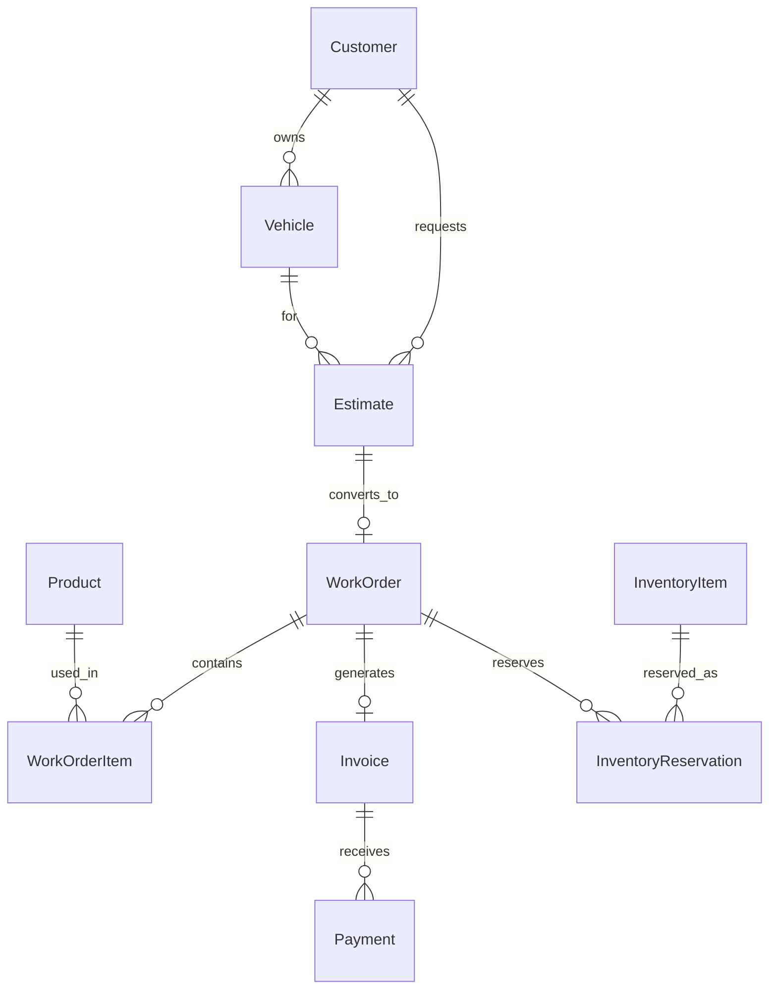

# DETSMS Design Document

## Overview

This design document outlines the technical architecture for the Durion Enterprise Tire Service Management System (DETSMS), a comprehensive tire service management system built on the Moqui Framework. The system implements a vertical slice architecture across five primary domains: Work Execution & Billing, Inventory Control, Product & Pricing, CRM, and Accounting, with a two-layer service architecture consisting of Moqui Base Layer and Experience Layer.

The design follows domain-driven design principles with clear boundaries, uses the durion-positivity integration layer for cross-domain communication, and provides multiple interfaces including UI, Mobile, and MCP (Model Context Protocol) for conversational AI integration.

## Architecture

### Domain Architecture

The system is organized into five vertical domains, each owning their complete stack:

#### 1. Work Execution & Billing Domain (Primary Flow Owner)
- **Responsibility**: Estimate → Workorder → Execution → Invoice → Payment flow
- **Core Entities**: Estimate, WorkOrder, WorkOrderItem, Invoice, Payment
- **Key Services**: EstimateServices, WorkOrderServices, InvoiceServices
- **Experience APIs**: Work execution orchestration, billing workflows

#### 2. Inventory Control Domain (Support Flow Owner)
- **Responsibility**: Parts availability, reservation, consumption
- **Core Entities**: InventoryItem, InventoryReservation, InventoryTransaction
- **Key Services**: InventoryServices, ReservationServices
- **Experience APIs**: Inventory lookup, reservation management

#### 3. Product & Pricing Domain (Reference Data Owner)
- **Responsibility**: Product catalog, pricing structures, service definitions
- **Core Entities**: Product, ProductCategory, PriceRule, ServiceType
- **Key Services**: ProductServices, PricingServices
- **Experience APIs**: Catalog management, pricing calculations

#### 4. CRM Domain (Customer & Vehicle Owner)
- **Responsibility**: Customer information, vehicle management, service history
- **Core Entities**: Customer, Vehicle, ServiceHistory, CustomerPreference
- **Key Services**: CustomerServices, VehicleServices
- **Experience APIs**: Customer lookup, vehicle management

#### 5. Accounting Domain (Prototype Level)
- **Responsibility**: Basic accounts receivable, payment tracking
- **Core Entities**: Account, AccountTransaction, PaymentApplication
- **Key Services**: AccountingServices, PaymentServices
- **Experience APIs**: Simple accounting reports, payment tracking

### Layered Architecture

#### Moqui Base Layer
- **Entities**: XML entity definitions with proper relationships and constraints
- **Domain Services**: Core business logic services following Moqui patterns
- **State Transitions**: Workflow management for estimates, workorders, invoices
- **Security**: Entity-level security constraints and service authorization

#### Experience Layer
- **Orchestration Services**: Task-oriented services that coordinate multiple domains
- **DTOs**: Data transfer objects for API responses
- **API Endpoints**: REST endpoints for UI, Mobile, and MCP integration
- **Cross-Domain Coordination**: Uses durion-positivity for inter-domain communication

## Components and Interfaces

### Core Components

#### 1. Work Execution Component (durion-workexec)
**Purpose**: Manages the primary business flow from estimate to payment

**Key Interfaces**:
```groovy
// Estimate Management
interface EstimateServices {
    Map createEstimate(Map estimateInfo)
    Map convertEstimateToWorkOrder(String estimateId)
    Map updateEstimateStatus(String estimateId, String status)
}

// Work Order Management  
interface WorkOrderServices {
    Map assignWorkOrder(String workOrderId, String mechanicId, String bayId)
    Map updateWorkOrderProgress(String workOrderId, Map progressInfo)
    Map completeWorkOrder(String workOrderId, Map completionInfo)
}

// Invoice Management
interface InvoiceServices {
    Map generateInvoiceFromWorkOrder(String workOrderId)
    Map processPayment(String invoiceId, Map paymentInfo)
}
```

#### 2. Inventory Component (durion-inventory)
**Purpose**: Manages parts inventory and availability

**Key Interfaces**:
```groovy
interface InventoryServices {
    Map checkPartAvailability(String productId, String locationId)
    Map reserveInventory(String workOrderId, List<Map> parts)
    Map consumeInventory(String workOrderId)
    Map receiveInventory(String productId, BigDecimal quantity, String locationId)
}
```

#### 3. Product Component (durion-product)
**Purpose**: Manages product catalog and pricing

**Key Interfaces**:
```groovy
interface ProductServices {
    Map getProductInfo(String productId)
    Map searchProducts(Map searchCriteria)
    Map getProductAlternatives(String productId)
}

interface PricingServices {
    Map calculatePrice(String productId, String customerId, Date effectiveDate)
    Map getCustomerPricing(String customerId)
}
```

#### 4. CRM Component (durion-crm)
**Purpose**: Manages customer and vehicle information

**Key Interfaces**:
```groovy
interface CustomerServices {
    Map lookupCustomer(Map searchCriteria)
    Map createCustomer(Map customerInfo)
    Map updateCustomer(String customerId, Map updateInfo)
}

interface VehicleServices {
    Map addVehicle(String customerId, Map vehicleInfo)
    Map getVehicleServiceHistory(String vehicleId)
    Map updateVehicleInfo(String vehicleId, Map updateInfo)
}
```

#### 5. Experience Layer Component (durion-experience)
**Purpose**: Provides orchestration and task-oriented APIs

**Key Interfaces**:
```groovy
interface WorkflowOrchestrationServices {
    Map createEstimateWorkflow(Map requestInfo)
    Map processWorkOrderWorkflow(String workOrderId, Map actionInfo)
    Map completeServiceWorkflow(String workOrderId)
}

interface MobileAPIServices {
    Map getMechanicWorkOrders(String mechanicId)
    Map updateWorkOrderFromMobile(String workOrderId, Map updateInfo)
    Map captureWorkOrderPhotos(String workOrderId, List<Map> photos)
}

interface MCPServices {
    Map processNaturalLanguageQuery(String query, Map context)
    Map executeConversationalAction(String action, Map parameters)
}
```

## Data Models

### Core Entity Relationships



### Key Entity Definitions

#### Work Execution Entities
```xml
<!-- Estimate Entity -->
<entity entity-name="Estimate" package="durion.workexec">
    <field name="estimateId" type="id" is-pk="true"/>
    <field name="customerId" type="id"/>
    <field name="vehicleId" type="id"/>
    <field name="statusId" type="id"/>
    <field name="estimateDate" type="date-time"/>
    <field name="totalAmount" type="currency-amount"/>
    <relationship type="one" related="Customer"/>
    <relationship type="one" related="Vehicle"/>
    <relationship type="one" related="StatusItem"/>
</entity>

<!-- Work Order Entity -->
<entity entity-name="WorkOrder" package="durion.workexec">
    <field name="workOrderId" type="id" is-pk="true"/>
    <field name="estimateId" type="id"/>
    <field name="mechanicId" type="id"/>
    <field name="bayId" type="id"/>
    <field name="statusId" type="id"/>
    <field name="scheduledDate" type="date-time"/>
    <field name="completedDate" type="date-time"/>
    <relationship type="one" related="Estimate"/>
    <relationship type="one" related="Person" title="Mechanic"/>
</entity>
```

#### Inventory Entities
```xml
<!-- Inventory Item Entity -->
<entity entity-name="InventoryItem" package="durion.inventory">
    <field name="inventoryItemId" type="id" is-pk="true"/>
    <field name="productId" type="id"/>
    <field name="facilityId" type="id"/>
    <field name="quantityOnHand" type="number-decimal"/>
    <field name="availableToPromise" type="number-decimal"/>
    <relationship type="one" related="Product"/>
    <relationship type="one" related="Facility"/>
</entity>
```

## Correctness Properties

*A property is a characteristic or behavior that should hold true across all valid executions of a system-essentially, a formal statement about what the system should do. Properties serve as the bridge between human-readable specifications and machine-verifiable correctness guarantees.*

### Property Analysis

Based on the requirements analysis, the following correctness properties ensure the DETSMS system operates correctly:

**Property 1: Estimate to WorkOrder conversion consistency**
*For any* approved estimate, converting it to a workorder should preserve all line items, pricing, and customer/vehicle associations
**Validates: Requirements 1.2**

**Property 2: Inventory reservation integrity**
*For any* workorder with parts, the system should prevent overselling by ensuring reserved quantities are properly tracked and consumed
**Validates: Requirements 2.2, 2.3**

**Property 3: Customer lookup consistency**
*For any* customer search criteria (phone, name, vehicle), the system should return consistent results across all lookup methods
**Validates: Requirements 3.1**

**Property 4: Pricing calculation accuracy**
*For any* product and customer combination, pricing calculations should return consistent results based on effective date and customer-specific rules
**Validates: Requirements 4.3, 4.4**

**Property 5: Mobile synchronization consistency**
*For any* workorder update made through mobile interface, changes should be immediately reflected in the main system
**Validates: Requirements 5.4**

**Property 6: Invoice generation completeness**
*For any* completed workorder, the generated invoice should include all workorder items with accurate pricing and proper customer billing information
**Validates: Requirements 7.1**

**Property 7: Positivity backend integration consistency**
*For any* business logic implementation, the system should use Positivity Backend APIs for data persistence and create specifications for missing APIs when required
**Validates: Requirements 8.1, 8.2, 8.3**

**Property 8: Component dependency compliance**
*For any* durion component implementation, the system should follow proper component dependency hierarchy and use durion-theme for UI components
**Validates: Requirements 9.1, 9.2, 9.3**

**Property 9: Security pattern enforcement**
*For any* authentication or authorization implementation, the system should use JWT-based authentication and proper security constraints
**Validates: Requirements 10.1, 10.2**

**Property 10: Performance optimization consistency**
*For any* database query or caching implementation, the system should follow efficient patterns with proper indexing and invalidation strategies
**Validates: Requirements 10.3, 10.4, 10.5**

## Error Handling

### Domain-Level Error Handling
- **Work Execution Errors**: Invalid state transitions, missing required data, authorization failures
- **Inventory Errors**: Insufficient stock, reservation conflicts, location mismatches
- **Customer Errors**: Duplicate customer detection, invalid vehicle data, missing required fields
- **Pricing Errors**: Missing price rules, invalid date ranges, customer-specific pricing conflicts

### Integration Error Handling
- **Cross-Domain Communication**: Timeout handling, retry mechanisms, fallback strategies
- **External System Integration**: API failures, data format mismatches, authentication issues
- **Mobile Synchronization**: Offline mode handling, conflict resolution, data validation

### User Experience Error Handling
- **Validation Errors**: Clear field-level validation messages, form state preservation
- **System Errors**: User-friendly error messages, graceful degradation, support contact information
- **Performance Issues**: Loading indicators, timeout warnings, retry options

## Testing Strategy

### Dual Testing Approach

**Unit Testing**:
- Service-level testing for each domain component
- Entity validation and constraint testing
- Business logic verification with specific scenarios
- Error handling and edge case validation

**Property-Based Testing**:
- Universal properties that should hold across all business workflows
- Cross-domain consistency validation
- Data integrity verification across state transitions
- Performance characteristics under various load conditions

**Property-Based Testing Framework**: 
The implementation will use **Spock Framework** with **QuickCheck for Groovy** as the property-based testing library, configured to run a minimum of 100 iterations per property test.

**Property Test Tagging**:
Each property-based test will be tagged with comments explicitly referencing the correctness property from this design document using the format: `**Feature: DETSMS, Property {number}: {property_text}**`

### Integration Testing Strategy

**Cross-Domain Testing**:
- Test workflows that span multiple domains (estimate → workorder → invoice)
- Validate durion-positivity integration layer functionality
- Test data consistency across domain boundaries

**API Testing**:
- REST endpoint validation for all Experience Layer APIs
- Mobile API functionality and offline synchronization
- MCP conversational interface testing

**End-to-End Testing**:
- Complete business workflow testing (service request to payment)
- Multi-user scenario testing (mechanic, service advisor, manager)
- Performance testing under realistic load conditions

### Validation Criteria

**Functional Validation**:
- All user stories implemented with acceptance criteria met
- Business workflows operate correctly across all domains
- Data integrity maintained throughout all operations
- Error handling provides appropriate user feedback

**Technical Validation**:
- Architecture follows Moqui Framework best practices
- Security requirements implemented and validated
- Performance targets met under expected load
- Code quality standards enforced across all components

**Integration Validation**:
- Cross-domain communication operates reliably
- Mobile interface synchronizes correctly with main system
- MCP conversational interface provides accurate responses
- External system integrations handle failures gracefully